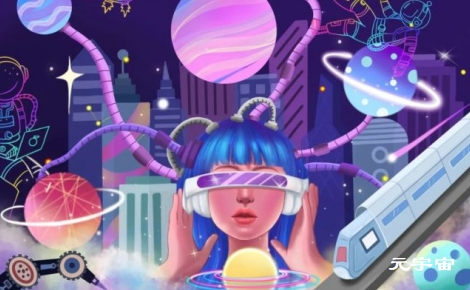

# 元宇宙场景：虚实共生的二元平行世界

2021年，由于有很多全球知名大企业都在涉足元宇宙。一时间元宇宙成了资本市场甚至全社会最前沿、最受关注的话题。赞之者认为元宇宙是越来越真实的数字虚拟世界，是下一代互联网，它将引领我们从电脑、手机的二维平面世界跨入AR、VR、XR的三维立体世界，从“在线”到“在场”，其对世界的影响堪比互联网和移动互联；而贬之者则认为它既无[技术](https://www.woshimeta.com/tag/技术)创新，也无产品创新，纯属投机炒作，元宇宙的尽头是“一场击鼓传花式的金融骗局”，更有人称“元宇宙将是整个人类文明的一次内卷”，会让人们长期沉浸于AR/VR的虚拟世界，影响人类对“星辰大海”的理想追求。那么，元宇宙到底是投机炒作，还是人类未来？元宇宙会促进科研的发展进而改变人们的生活，还是会放缓人们探索大自然的步伐呢？

首先，可以从场景创新的角度解释元宇宙。如果没有足够的应用场景，5G也好，人工智能、区块链技术也罢，这些伟大技术本身的价值自然会受到社会怀疑。而元宇宙不仅为5G技术提供了足够广阔的应用场景，也为人工智能、区块链、大数据、云计算等很多新技术以及AR、VR产品、数字货币、数字资产、游戏、传媒、电影等产品创新提供了体量足够大的应用场景。
元宇宙的场景创新跟以前的移动互联网不同，它从二维的空间深入到三维的空间，即将构建一个庞大的数字虚拟世界，也可以把它叫做数字平行空间或数字平行世界。在与现实世界平行的一个全新的史无前例的平行空间上展开无边无际的场景创新，元宇宙必将带来很多新供给、创造出很多新需求，不断改变人们的生活方式，并带来新的经济增长。
元宇宙的场景创新空间有多大？可以先想象一下，单纯把现实的世界复制到数字平行空间就有多少创新和增长！在90年代末移动互联网出现的时候，第一代互联网人说我们让世界上的每一粒沙都拥有一个IP地址；那么[元宇宙时代](https://www.woshimeta.com/tag/元宇宙时代)，人们会不会将日月星辰、海洋湖泊、山川陆地、楼宇道路等等，都在数字平行世界做出全景、立体的呈现呢？当然!事实上这样的创造早已开始，在笔者参观过的一个中国某视觉工业中心，工作人员已经在数字世界初步复制了银河系的大部分日月星辰，也复制了地球上大部分的海洋，当我们带上AR/VR眼镜，我们不仅可以畅游在星系间、海洋中，甚至还可以挥一挥手，与海洋中的鱼儿互动——未来如果有游戏或电影制作商需要在这里拍摄一个故事，或者军方需要某一个数字平行世界的山峦或城市间模拟一场战斗，我们能说这样的数字资产没有市场价值吗？
元宇宙数字平行空间的场景创作和创造绝不仅仅局限于复制现实世界，还可以源自人们无穷无尽的想象力。无论是山海经或西游记中的魔幻场景、人、物、神兽，还是哈利•波特的魔法世界，都可以在元宇宙虚拟世界尽情地立体化呈现，并让通过AR、VR或其他入口进入这个数字平行空间的人们与这里的人、物、场景近距离地密切接触，尽情地互动。伴随着数字平行空间的虚拟数字人、物、场景原来越多，虚拟社会的互动越来越多，互动关系越来越丰富，一个庞大的数字平行世界逐渐形成。
当然，元宇宙数字平行空间的场景、人、物，还可以走出数字平行空间的虚拟世界，以实物的方式按照一定比例呈现在现实世界——可以想象，元宇宙时代将有大量来自虚拟世界的场景、人物、动物越来越多地呈现在现实世界。5到15年后，无论我们走在哪个公园和游乐场，那里都既有现实世界的湖泊、植物、动物，也有来自数字平行世界，在那里创作后复制到现实世界的各种场馆、场景、人物、动物、植物……这种创作和向现实世界的复制可以有多大的体量，带来多大的市场，带来多少产品的应用，如何改变现实世界和人们的生活，实在是难以想象！
有人把现实世界的人、物、场景复制到数字虚拟空间叫做“数字孪生世界”，把完全在数字虚拟空间创造的人、物和场景叫做“数字原生世界”，把从数字虚拟世界映射到现实世界并与现实世界互动的情况叫做“虚拟共生世界”。想象一下，也许十年后，当我们带上AR/VR头盔就可以瞬间进入数字虚拟世界，或穿梭到万里之外的比赛“现场”，并与虚拟世界的人、物、场景互动；当从数字虚拟世界来的各种人（AI机器人）、物、场馆在现实世界无处不在，我们还能够区分数字孪生与数字原生，还能够区分现实的体验与数字虚拟世界的体验吗？
按照量子理论，物质既是粒子，也是波，因而世界本就是二元的，既有物化世界形态，也有波的形态。按照林左鸣先生的“二元价值容介态”理论，宇宙的底层属性本来就是二元的，一种是物质形态，一种是信息形态，就如同中国太极图中的阴阳鱼，物质世界和信息世界互相作用，共同推动宇宙进化。
所以，元宇宙不仅仅指数字虚拟世界，而是由物质世界、信息世界互相影响、互相促进的虚拟共生的世界，既二元平行世界，元宇宙首先带给这个世界的核心驱动力，是数字平行世界的一次“宇宙大爆炸”，进而引发虚实共生的二元世界的场景创新大爆炸。