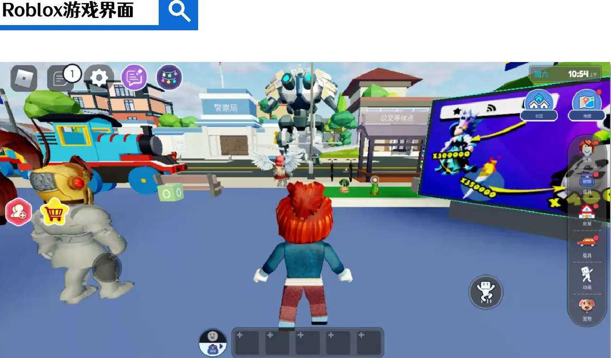
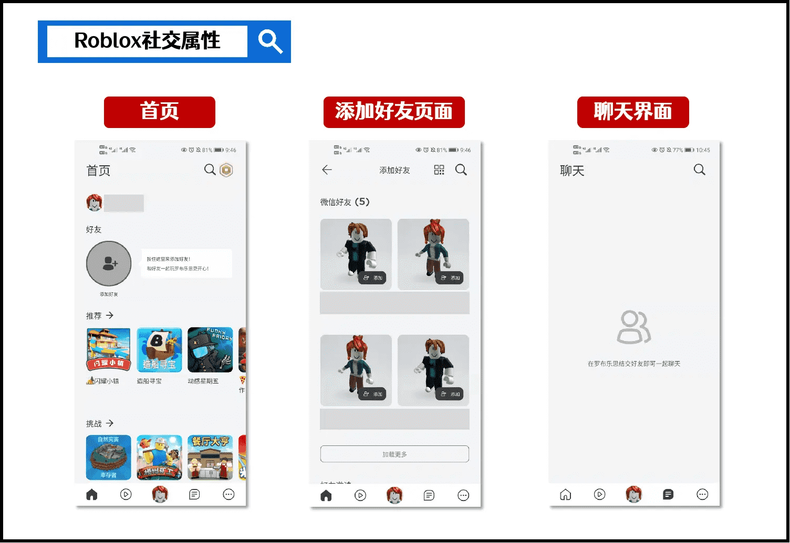

## 元宇宙的未来，从游戏到商业化应用

 > 说到最近大热的概念，元宇宙一定算一个。去年3月一家做少儿游戏平台的公司「Roblox」上市，“元宇宙”第一次被大众认知。而《失控玩家》的热播，更是让其声名远扬。本文作者将对此进行分析，一起来看看吧。

最近，互联网科技圈中最火的一个词，莫过于「元宇宙」。2021年3月，一家做少儿游戏平台的公司「Roblox」上市。在其招股说明书中，首次引入「元宇宙」的概念，上市首日大涨54%，市值超过380亿美金，被称作「元宇宙概念股」。

## 01 读懂「元宇宙」之前，先了解Roblox

听起来很科技，但Roblox做的却是游戏业务。进入Roblox界面，你甚至会有点失望。低像素的界面设计，没有竞技性的游戏体验，实在不理解为什么会创造市值奇迹。

**Roblox本身就是一款少儿向游戏，玩家偏低龄化。**创业者的初衷，是建立一个让孩子们发挥想象力的游戏平台。Roblox的活跃用户4210万人，活跃的开发者800万人。但在数千万的活跃用户里，**13岁以下用户占比54%，25岁以上用户仅占15%。**

**Roblox最直观的3个特点，①是社交属性，②是用户共创，③是3D虚拟界面。**

1. **社交属性：**打开Roblox首页，可以看到在个人头像下方，有醒目的“添加好友”提示。外媒TheVerge报道称，在16岁以下的美国儿童和青少年群体中，有超过一半都沉浸在Roblox的虚拟世界中。Roblox里有专门的聊天界面，可以像社交软件一样使用。Roblox还能让大家举办线上虚拟生日会、社交Party或者演唱会。
2. **用户共创：**在“添加好友”模块的下方，是Roblox推荐的用户自创的游戏，主要有射击、模拟建造、竞速跑酷、益智解谜等多种类型。Roblox不制作任何游戏内容，只提供编辑工具和素材，让用户自由创作。跟PGC（专业机构创作内容）相比起来，UGC（用户自创内容）开发成本和风险往往更低。
3. **3D虚拟界面：**打开任一款游戏，可以看到一个乐高风格的3D虚拟世界。Roblox是从最初的2D教育平台转换为3D游戏平台的。创始人David Baszucki于1989年以教育为目的创建名为Interactive physics的2D模拟物理实验平台。2004年时，创始人想要在更大的规模上复制其想象力与创造力，创建了Roblox。

除了以上直观的特点，Roblox区别于魔兽世界、王者荣耀等其他游戏最大的不同，是其自成体系的**「经济系统」**。一般认为，「元宇宙」不只是一个虚拟世界，**它还应该拥有一整套社会、经济运作体系。**

Roblox通过Robux币形成经济生态闭环，向开发者和用户两端收铸币税。开发者自建内容赚取Robux；用户通过Robux进行交易，购买皮肤、游戏工具。与其他游戏平台所说的“氪金”不同的是，Robux能兑换成现实中的货币——玩家可以花1美元购买100个Robux，100个Robux可以兑现35美分。

比如说，人民币和美元是两套不同的经济体系。你可以在以人民币结算的地方，使用人民币进行交易，同时你也可以以一定汇率兑换美元。Robux也是这样一套虚拟世界里的经济体系，你可以在Roblox的虚拟世界里，使用Robux进行交易，同时也能以一定汇率兑换现实中的货币。

**小结：**Roblox是一个3D虚拟游戏平台，由玩家自行开发玩法（UGC），拥有社交属性，拥有独立的经济体系。不过问题来了，游戏+社交+经济系统，就等于元宇宙了吗？

## 02 聊聊「元宇宙」的过去与现在

「元宇宙」概念本身来源于科幻小说，火爆于科幻电影。

- **科幻小说《雪崩》****首次提出「元宇宙」概念：**1992年，科幻作家NealStephenson在其著作《雪崩》中提出「元宇宙（Metaverse）」概念。Metaverse，即Meta（超越）+Universe（宇宙），可以理解为一个平行于现实世界的虚拟世界。用户以自定义的“化身”（Avatar）在其中进行活动。
- **科幻电影《头号玩家》，引爆观众对「元宇宙」的期待：**电影《头号玩家》中，塑造出一个虚拟世界绿洲（Oasis），**被认为是最接近元宇宙的形态。**人们可以在虚拟世界中赛车、冒险。所有在虚拟世界的感官刺激，都可以通过体感服或者VR设备，对现实世界中的人产生真实的感官体验。

此外，还有《西部世界》、《失控玩家》等电影，都为我们展现了一个平行的虚拟世界，玩家以另一个身份在虚拟世界中，经历着“第二人生”。虚拟与现实之间，可以随时随地切换。

**从1992年就提出的「元宇宙」概念，时隔29年，怎么就突然火了呢？**

这和近几年VR、AR技术的风靡不无关系。Facebook、索尼、苹果等科技巨头陆续推出新款VR/AR设备，进一步打开VR/AR市场空间。而且，云计算、5G、人工智能等技术的高速发展，也刺激了元宇宙的**「概念复苏」**。

**Roblox恰好把握了这个时机，明明是一家游戏公司，却包装出一个科技概念。**

这像极了广告公司提案。基于产品“卖点”本身，提出一个更宏观的概念，让人不明觉厉。只要能自圆其说，就能给投资人无限的想象力。

**在Roblox的招股说明书中，给出了「元宇宙」明确的定义：**

> 元宇宙是一个将所有人相互关联起来的**3D虚拟世界**，人们在元宇宙拥有自己的**数字身份**，可以在这个世界里**尽情互动**，并**创造任何他们想要的东西**。Roblox只是创造元宇宙的用户的‘牧羊人’，我们不制作也不控制任何内容。

也就是说，你在Roblox的3D虚拟世界里，可以有另一个身份，可以交朋友，可以谈恋爱，可以实现科学家的梦想，甚至可以拯救世界。

Roblox公司认为，元宇宙应该具备**「8**大要素」，分别是：Identity（身份）、Friends（朋友）、Immersive（沉浸感）、Low Friction（低延迟）、Anywhere（随地）、Variety（多样性）、Economy（经济）、Civility（文明）。

- Identity（身份）：你可以拥有一个虚拟身份，与现实身份无关，可以是总统，也可以是乞丐。
- Friends（朋友）：你可以拥有朋友，可以社交，无论在现实中是否认识。
- Immersive（沉浸感）：你可以沉浸在元宇宙的体验里，暂时忘掉现实世界。
- Low Friction（低延迟）：元宇宙里的一切都是同步发生的，没有时间延迟。
- Anywhere（随地）：你可以在任何地方登陆元宇宙，不受空间束缚。
- Variety（多样性）：你可以体验元宇宙里的各种玩法、道具等丰富内容。
- Economy（经济）：元宇宙拥有自己的经济体系。
- Civility（文明）：人们聚集在一起，创造独特的社会文明。

「身份」和「朋友」是目前大多数游戏都可以实现的，玩家可以创建自己喜欢的角色，并与其他玩家进行互动，形成社交关系。

「沉浸感」、「低延迟」和「随地」需要网络提速、VR/AR等终端设备的完善，元宇宙的完美体验大概需要16K以上的720°高清影像、180Hz以上的刷新率、5ms以下的延时。目前的5G网络，更多应用于4K 高清视频、360 °全景视频的流畅观看，120Hz的屏幕刷新率已经算是非常优秀，可见两者技术水平还有很大差距。

「多样性」需要完善的内容创作生态，这也是目前Roblox努力的方向。

「经济」需要区块链技术作为货币体系基础，让金融契约以程序化、非托管、可验证、可追溯、可信任的方式进行去中心化运转，大幅降低金融系统中可能存在的腐败和暗箱操作等有害行为。

「文明」目前的游戏，离文明还有一定距离，最多算是文化。

**小结：**「元宇宙」的概念来源于科幻小说/电影，游戏可以算是元宇宙的初级形态。在技术方面，目前游戏与元宇宙还有很大差距；哲学和意识形态方面，元宇宙才刚刚起步。

## 03 元宇宙的未来，从游戏到商业化应用

「元宇宙」只是一个关于互联网未来形态所借用的科幻概念。但不可否认的是，物理世界与虚拟世界融合，将成为未来十年重要的赛道。目前，全球科技巨头纷纷布局“元宇宙”，寻找移动互联网的下一个风口：

- 扎克伯格明确表示，接下来5年Facebook要变成“元宇宙公司”；
- 马化腾称移动互联网十年即将迎来下一波升级，并称之为全真互联网（线上线下一体化），同时腾讯是Roblox的中国战略合作方；
- 今年8月，智能芯片巨头英伟达自曝，在4月份举行的发布会上，CEO黄仁勋的演讲中有14秒由数字合成的“假人”代为出镜，并顺势推出虚拟协作平台Omniverse，号称是工程师的元宇宙；
- 同在8月，字节跳动收购Pico（国内VR硬件公司）入局元宇宙。

以游戏作为切入点，以社交作为突破口，**但**商业化应用才**是元宇宙未来价值所在。**设想一下，元宇宙将在各行各业为我们带来哪些改变？我想至少会有以下三类：在企业生产规划中，实现**更科学的模拟测试**；在人与人交流中，带来**更自然的交互模式**；在远程观展旅游中，带来**更沉浸式的观赏体验**。

**1）更科学的模拟测试**

人工智能计算公司英伟达（NVIDIA）在今年4月，发布面向企业的Omniverse设计协作和模拟平台。从2020年10月推出测试版开始，据称已有超过17,000名客户进行了测试体验，包括宝马、爱立信、沃尔沃、Adobe、Epic Games在内等众多公司。

- 比如宝马与Omniverse共建虚s拟工厂，造车之前先打造数字模型。位于不同时区、不同地点的员工可以随时访问，共同规划并优化生产流程及工艺。
- 比如通信公司爱立信借助Omniverse平台，对5G网络架构进行模拟。可以克服人工操作的困难，在虚拟世界中探索任何城市的独特地理环境及其对无线网络性能的影响，无论是旧金山的丘陵还是法兰克福的高楼大厦都不例外。
- 再如沃尔沃使用Omniverse来测试自动驾驶汽车。汽车厂家可以在虚拟世界中，测试各种现实世界无法测试（或无法简单测试）的项目，而且测试时间大幅缩短。

此外，还有建筑、房地产、家居等行业，可以借助「元宇宙」实现变革式发展。比如建筑师、工程师和设计师可以在同一个平台上，共同完成空间设计；比如了解新房信息时，可以模拟不同季节、不同时间，体验不同温度、湿度、光照与噪音带来的住房体验。

目前广泛应用的传统三维建模，无法满足元宇宙世界对于视觉上、物理法则上无限接近真实世界的要求，其仅仅以二维视觉实现三维效果。相信未来会有更多设计者、创造者，在虚拟世界中设计数字事物，然后才在现实世界中完成，整个过程更周密、更高效。

**2）更自然的交互模式**

Facebook创始人兼首席执行官马克·扎克伯格认为，目前我们通过电脑、手机、投影等屏幕来进行交流，缺乏空间感，不符合人类的互动方式。比如，我们在进行远程会议时，只能通过屏幕看到一张张人脸组成的网格，所有人说话都来自同一个地方。但实际上，我们习惯于与人共处一室，我能看到正在说话的人是在我的左边还是右边，获得一种空间感。

未来，在「元宇宙」技术的帮助下，人们互动的方式将更自然、更真实。我们都以全息图的方式，出现在同一个空间里。我会看到你坐在我的左边，正在侃侃而谈；你也会看到我坐在你的右边，认真倾听并与你眼神交流。纵使远隔万里，也能感觉身处一室。

**3）更沉浸式的观赏体验**

目前大多数线上展览、旅游，都是静态和预先定制好的「单人」体验。而在未来的元宇宙中，我们或许能体验到更沉浸式、独一无二的旅程。

今年5月，时尚奢侈品牌GUCCI与Roblox打造的沉浸式展览活动——GUCCI Garden Archetypes，就有类似的设计。展览设计了不同的主题房间，比如在「致敬黑人文化」的房间里，参观者可以在「舞池」里，与2017年早秋时装秀的舞者一同热舞。在游览过程中，参观者会化身为一个中性的人体模型，没有年龄或性别。不同的参观顺序，会使人体模型保留不同的空间片段，形成个性化的游览“记忆”。

在未来的元宇宙中，旅游可以支持多人共同体验，几个朋友通过远程呈现的虚拟世界，一起游览某一个景点，实时交流所见所想。有些到不了的远方，就让元宇宙来满足我们吧。

## 04 写在最后

目前，元宇宙由于不少技术上的阻碍，还难以实现实时的沉浸式交互、逼真的高质量图像渲染等，**仍**处于概念阶段**，**但真实世界与虚拟世界融合已然成为趋势。移动互联网的下一站，将是线上线下一体化的，跨时空交互的，突破电脑与手机等屏幕的限制。

在「元宇宙」概念大火之下，所有与VR/AR硬件设备、5G、云计算、区块链相关的企业，甚至是做虚拟人像的、社交游戏的，都为自己贴上“元宇宙”的标签。仿佛只要沾上了“元宇宙”的边，就站上了互联网变革的风口。

**事实上，元宇宙并不是一家公司能实现的事情，它需要整个科技行业共同参与，合力打造这一目标。**至于什么时候会出现真正的元宇宙产品，什么时候电影《头号玩家》里的“绿洲”会成为现实，都是未知数。但我们能期待的是，以「元宇宙」为愿景，互联网技术将会从硬件、软件、内容层面实现全面突破。