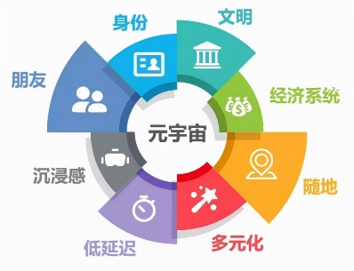
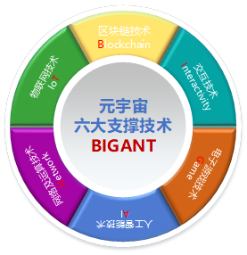
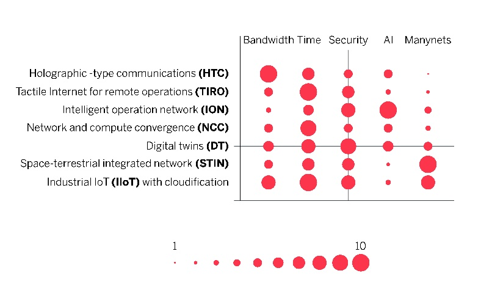
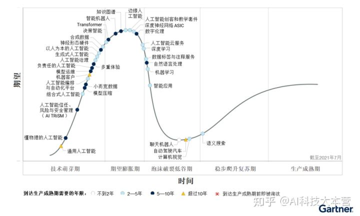

自元宇宙一词诞生至今，对其概念的理解众说纷纭，但可以肯定的是，元宇宙绝对不仅仅是游戏或社交媒体，而应该具有丰富的内涵。EpyllionCo管理合伙人、鲍尔元宇宙研究机构联合创始人马修·鲍尔（Matthew Ball）称元宇宙“是一个和移动互联网同等级别的概念”，而Facebook创始人马克·扎克伯格（Mark Zuckerberg）也认为元宇宙“不仅仅是游戏，我们相信它是移动互联网的继承者”，当然，也有专家认为元宇宙并不是下一代互联网，而是1969年互联网诞生后，不断发展产生的阶段性技术范式。

那究竟什么是元宇宙呢？Roblox的CEO大卫·巴斯祖奇（David Baszucki）在Roblox的招股书[1]中提出，Roblox平台具备以下八大关键特征：身份（Identity）、朋友（Friends）、沉浸感（Immersive）、低延迟（Low Friction）、多元化（Variety）、随地（Anywhere）、经济系统（Economy）和文明（Civility），这八项关键特征，也被许多人认为是评判一款产品是否是真正的元宇宙产品的标准。

图 1 元宇宙的八大关键特征[1]

从该标准看，元宇宙可以看作是一个MMO游戏，但又不仅仅是一个游戏，而是结合了开放式任务、可编辑世界、XR入口、AI内容生成、经济系统、社交系统、化身系统、身份认证系统和现实元素等的综合平台，元宇宙不是单纯的虚拟世界，而是虚拟世界与现实世界的结合。在元宇宙中，需要实现虚实二界的流动交换，包括意义、价值、信息、权力、情感、关系、购买力、注意力、传播力等[2]。从本质上看，元宇宙是要构建一个与现实世界持久、稳定连接的数字世界。

Beamable的创始人乔·拉多夫（Jon Radoff）从价值链的角度提出了构造元宇宙的七个层面，从低到高依次为：基础设施（Infrastructure）、人机交互（Human Interface）、去中心化（Decentralization）、空间计算（Spatial Computing）、创作者经济（Creator Economy）、发现（Discovery）和体验（Experience）。

图 2 Jon Radoff提出的元宇宙价值链的七个层面[3]

从创作者经济、发现和体验三个层次，不难发现，相对于在普通游戏中，玩家作为内容的消费者，而在元宇宙中，用户既是内容的创造者，又是内容的放大器，即内容不仅仅是由用户创造产生，更多的是在用户的互动中产生，内容产生内容。而元宇宙的沉浸感，也不仅仅是指3D图像空间或故事世界的沉浸感，更多的是社交沉浸感以及基于此而激发互动和推动内容的沉浸感。

空间计算、去中心化、人机接口和基础设施则是构建元宇宙的技术基础，扮演了整个元宇宙生态的承载者身份，决定了元宇宙究竟是一场概念的炒作，还是一个可期的未来。

目前业界较为认可的是《元宇宙通证》[4]一书提出的元宇宙BIGANT六大技术全景图，主要包括区块链技术、交互技术、电子游戏技术、人工智能技术、网络及运算技术和物联网技术。

图 3 元宇宙六大支撑技术[4]

可以看出，这六大支撑技术基本可以覆盖前面元宇宙价值链中七个层面的下四层，下面对这六大支撑技术的现状及未来做简要介绍，希望借此可以让大家对元宇宙有更理性的认知。

首先，网络及运算技术可以说是基础中的基础，也是元宇宙未来落地并走向成熟可能面临的最主要的挑战。在网络及运算技术方面，通信网络（传输速率）的提升一直是主旋律，此外，低时延高可靠、大连接等新特性更是元宇宙绕不过去的新需求，可以说，随着通信网络和云游戏的成熟，可以进一步夯实元宇宙网络层面的基础。主要包括5G/6G网络、Wi-Fi 6/Wi-Fi 7网络、云计算、边缘计算等，其中最核心的是5G/6G网络的发展，尤其是6G网络，从最初的场景和需求开始，就与元宇宙的概念高度契合，如图 4所示的ITU-T FG NET2030提出的首批应用场景就考虑了包括AR/VR/全息类型的应用，还有触觉网络、算力网络、数字孪生、智慧运营网络等，这些应用场景及其对应的网络需求可以看作是部分或全部的元宇宙网络及运算需求。

图 4 2030网络应用场景与需求[5]

物联网技术为元宇宙万物互联及虚实共生提供可靠的技术保障，其中感知层技术为元宇宙感知物理世界万物的信号和信息来源提供技术支撑，网络层技术为元宇宙感知物理世界万物的信号传输提供技术支撑，而应用层技术则将万物链接并有序管理，是元宇宙万物的虚实共生的最重要支撑。在5G和6G的发展中，物联网的传输技术都考虑在内，除此之外，作为物联网技术最底层的传感器技术和嵌入式系统技术等还需要进一步发展，其中传感器技术的主要发展方向包括：一是开展基础研究，发现新现象，开发传感器的新材料和新工艺；二是实现传感器的集成化与智能化。

人工智能技术为元宇宙大量的应用场景提供技术支持。主要包括计算机视觉、机器学习、自然语言处理等。从图 5可以看出，虽然当前处于技术萌芽期的人工智能相关技术创新占据着很大比例，但是有一半的技术将在二到五年成为主流技术，表明当前人工智能市场整体上还处于逐步发展阶段，具有较好的发展前景。从推动人工智能创新上看，Gartner给出的四个趋势分别是：负责任的人工智能（Responsible AI）、小而宽数据（Small and Wide Data）、人工智能平台的操作化（Operationalization of AI Platforms）和资源高效利用（Efficient Use of Resources），其中影响最为深远的可能是数据变化，小而宽数据策略能够实现更强大的分析和人工智能，减少企业机构对大数据的依赖，并提供更丰富、更完整的情境感知，据Gartner预测，到2025年，70%的企业机构将被迫把重点从大数据转向小而宽数据。

图 5 Gartner人工智能技术成熟度曲线（2021）[6]

交互技术的持续迭代升级，为元宇宙用户提供沉浸式虚拟现实阶梯，不断深化感知交互。主要包括虚拟现实技术（VR）、增强现实技术（AR）、混合现实技术（MR）、全息影像技术、脑机交互技术、传感技术等。交互技术可以说是元宇宙的核心部分，是通往元宇宙的实现路径，甚至很多人认为基于高度沉浸式的扩展现实（XR）实现的虚拟游戏宇宙（如《头号玩家》中的“绿洲”）是元宇宙发展的终极形态。截止到去年年底，虚拟现实相关技术成熟度如图 5所示，可以看出有相当多的关键技术发展至主流所需年限在5到10年内，甚至部分技术如智能隐形眼镜、全息显示等需要十年以上的发展年限。除了前述网络及运算技术外的发展外，交互技术还需在近眼显示、渲染计算、内容制作和感知交互等方面进一步发展突破。

图 6 虚拟现实技术成熟度曲线（2020）[7]

游戏是元宇宙的呈现方式，它的交互灵活、信息丰富，为元宇宙提供创作平台、交互内容和社交场景并实现流量聚合。主要的游戏技术包括游戏引擎（如Unity、Epic等）、3D建模（如Autodesk、Maya等）、实时渲染（如ARC等）。游戏是元宇宙的最佳载体，更深的沉浸感和更的高自由度是提升用户体验满意度的重要指标，也一直是游戏技术突破的主要方向。当前主流的3D游戏仍然智能通过垂直屏幕展示游戏画面，玩家的交互也受制于键盘、鼠标和手柄等硬件设备，从沉浸感上远远达不到元宇宙的要求。除了网络与计算技术、人工智能技术、交互技术等方面的发展，游戏相关技术也需要进一步增强，尤其是作为游戏开发的基础支撑技术的游戏引擎的发展至关重要，尤其是针对未来差异较大的终端类型，需要保证一款游戏在多种平台上快速移植同时保证游戏运行流程和高质量的画面感，引擎跨平台研发技术将越来越重要。

区块链技术是支撑经济系统最重要的技术，主要包括非同质代币（NFT）、去中心化金融（DeFi）、公链速率、智能合约、去中心化自治组织（DAO）社交体系、去中心化交易所、分布式存储等。区块链可以在元宇宙中创造一个完整运转且链接现实世界的经济系统，玩家的资产可以顺利和现实打通，且区块链的完全去中心化，不受单一方控制，使得玩家可以持续地投入资源而不用担心某一家公司的退出导致的资产缩水或清零。在区块链相关技术中，NFT作为区块链框架下代表数字资产的唯一加密货币令牌，未来将是元宇宙的经济基石。NFT目前在结算层、协议层和应用层上已经发展得比较完善并开辟了包括收藏品、游戏、虚拟世界等多个市场，未来可能更多的政策和法律法规问题。

总体来说，元宇宙的概念虽然由来已久，未来也可能拥有广阔的空间和无限可能，甚至成为5G乃至6G时代的杀手级应用，但在目前无论是各个支撑技术本身，还是多项技术融合上，对于实现真正的元宇宙，还存在许多不足。此外，元宇宙的发展是需要整个产业的协同发展，构建一个虚拟与现实深度融合、互相赋能的数字世界生态。

紫光展锐作为我国集成电路设计企业的龙头企业，要做数字世界生态的承载者，以生态为核心战略，高举5G和AI两面技术旗帜，以价值、未来、服务为三个指向，为个人和社会的智能化服务。

紫光展锐的主要产品包括移动通信中央处理器、基带芯片、AI芯片、射频前端芯片、射频芯片等各类通信、计算及控制芯片，为搭建数字世界和元宇宙的各项支撑技术赋能，抓住机遇，迎接挑战！

参考文献：

[1].

[2]. 清华大学新媒体研究中心，2020-2021年元宇宙发展研究报告

[3]. The Metaverse Value-Chain，Jon Radoff，

[4]. 邢杰、赵国栋、徐远重、易欢欢、余晨，中译出版社，《元宇宙通证——通向未来的护照》

[5]. Summary report on “representative use cases and key network requirements for Network 2030”， NET2030-O-035

[6]. Hype Cycle for Artificial Intelligence, 2021，Gartner，2021年7月

[7]. 虚拟（增强）现实白皮书，中国信通院，2021年3月