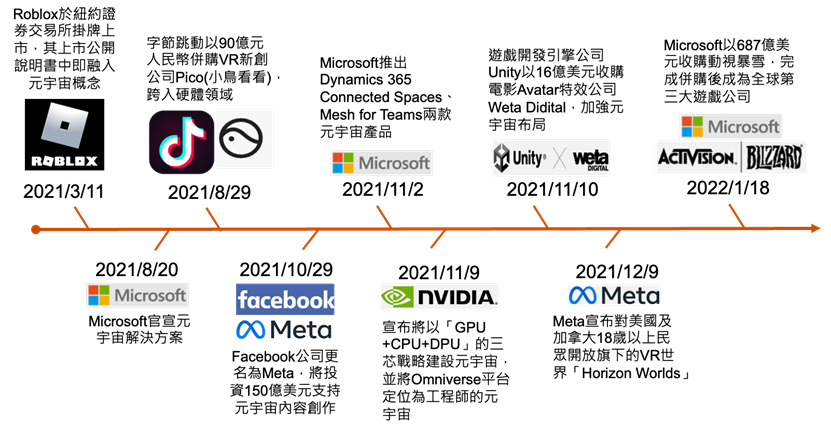

**COVID-19疫情影响下大规模的居家隔离、在家工作等因素限制了人与人之间的实体互动，数字转型及升级的浪潮随之而来，元宇宙(Metaverse)的概念也因此甚嚣尘上…**

以往小说或电影经常出现穿越时空、虚拟世界等科幻故事题材，在故事的世界中还可以连结虚拟世界与现实世界，并进而在两个时空中产生互动及影响。如今随着全球5G网络的普及，再加上COVID-19疫情影响下大规模的居家隔离、在家工作等因素限制了人与人之间的实体互动，数字转型及升级的浪潮随之而来，元宇宙(Metaverse)的概念也因此甚嚣尘上。

## 2021年为元宇宙概念发酵期

2021年初让民众认知元宇宙概念的，便是用户生产内容平台(Use Generated Content)游戏平台公司Roblox正式挂牌上市，特别的是其直接将元宇宙的概念写入其上市公开说明书中，元宇宙的概念开始在科技圈及金融圈快速蔓延，也引发大厂陆续加快元宇宙的布局工作。其中动作最大的莫过于Facebook更名为Meta，除了宣示其进军元宇宙的决心，并且推出其VR社交平台Horizon Worlds，成为Meta的第一个元宇宙服务；芯片大厂Nvidia在GTC 2021的年度发表会上大秀虚拟首席执行官，并且也推出Omniverse的元宇宙开发工具平台。

除此之外，自2021年以来元宇宙相关的并购事件也时有所闻，包括字节跳动并购了VR新创公司Pico，由平台营运商的角色踏入硬件领域，与2014年Facebook并购Oculus的布局方向如出一辙；Unity也以16亿美元取得电影Avatar的特效制作公司Weta Digital；而在2022年初Microsoft便大张旗鼓的宣布以687亿美元并购动视暴雪，一举成为全球仅次于腾讯及Sony的第三大游戏公司。2021年以来全球主要大厂元宇宙布局动态整理如图1所示。

 

*图1：2021年以来全球主要大厂元宇宙布局动态。*

## 元宇宙虽浩瀚无垠，但仍需逐梦踏实

这些看似不着边际的幻想，在软硬件科技及基础设施的不断升级之下，是有可能被实现的。当然，元宇宙概念的落实不可能一蹴可几，观察现阶段全球主要国际大厂在元宇宙的布局动态，元宇宙的发展大致可分为三个阶段：

第一阶段：在未来5~10年内，以游戏及社交为主的元宇宙概念平台将大量出现，相关游戏用户数快速增加，但深度玩家仍为少数。身历其境的游戏体验功能逐渐完善，VR/AR/XR等设备进入快速成长期，游戏营运商将在此用户基础上探索各种元宇宙各种可行的商业模式，除了游戏体验的持续提升外，包括虚拟偶像、专业用户生产内容(Professional User Generated Content，PUGC)、非同质化代币(Non-fungible Token，NFT)、区块链等商业应用领域成为平台发展的重要的方向。除此之外，在工业元宇宙、城市元宇宙、商业元宇宙等领域都将进入大量试验阶段。

第二阶段：在未来的10~20年间，虚拟和现实的边界将逐渐模糊化，人工智能参与元宇宙各项活动的程度持续提升，现实生活中的消费、金融、生活服务等元素都将无缝与元宇宙接轨，元宇宙的对大众的黏着度提升，用户在元宇宙的停留时间将大幅增加。

第三阶段：预计在未来的几十年内将持续发展，虚拟与现实世界已密不可分，日常生活、社交、工作、商业交易等大多数活动都可以在元宇宙中实现，在元宇宙中形成新文明。

当然，以目前的科技水平很难断言未来10年后的科技水平能让元宇宙发展到什么地步，就如同早期功能型手机(Feature Phone)、个人随身助理(Personal Digital Assistant，PDA)产品一直是两条并行线的产品线。功能手机主打通讯功能、PDA则是商务人士日的得力助手，随后虽不断有PDA结合手机功能的产品推出，但是一直到苹果在2007年推出第一款iPhone之后，才正式打开智能型手机市场。虽然智能型手机在各项硬件功能不断提升，但是支撑产品销售的背后主要力量，却是在软件、平台、服务各方面的快速发展，在线线下功能的结合全方位介入到人类的日常生活当中。因此，上述的三大阶段当中除了在第一阶段的发展情境较为明确之外，尔后的发展仍须视厂商在技术发展上如何跨越数字鸿沟，以及何种应用能让消费者买单而定；亦即短期受惠产业明确，但长期发展方向未定。

## 六大技术领域将优先受惠

- **构筑元宇宙世界的六大关键技术**

基于当前相关技术发展现况，以及预期未来在元宇宙发展的重要技术当中，至少包含以下六大技术及其相关产业链。包括基础网络设施提供元宇宙环境所需的网络带宽、随之而来的巨量数据运算需求，以及云端服务及边缘运算等算法的持续优化；人工智能技术作为元宇宙持续发展进化的原动力，并且将自动或协助人们产生元宇宙世界中的内容或关键要素；区块链技术提供元宇宙去中心化的经济运行规则，以及伴随而来的NFT交易将在元宇宙世界中大量发生；物联网技术提供人机接口设备上所需的感测技术，以及搜集玩家参与元宇宙活动时所产生的大量数据。

此外，在大量业者投入元宇宙生态系后，透过各种新的商业模式创新与合作，衍生出各式各样的元宇宙服务平台，涵盖游戏、社交、工商业活动、艺术创作，乃至于企业数字转型或是城市发展等相关情境都将百花齐放；而其中最为关键的产品便是人们应透过何种设备参与元宇宙活动，目前最主要的人机接口设备将是VR/AR的头显设备，预期VR/AR设备也将在这波元宇宙概念的推波助澜下优先受惠。元宇宙产业重点发展的六大技术领域汇整如图2所示。

 

*图2：元宇宙产业重点发展的六大技术领域。*

- **游戏元宇宙带动VR/AR产业快速成长**

VR/AR产品并非新的概念，事实上早在2016年时相关产品出货量接近1,000万台，而被视为是VR/AR产业元年，而实际上在当时的技术尚未成熟，长时间配戴VR设备所带来的晕眩及不适感较为强烈，因此市场在2017年后开始逐年下滑；而AR产品现阶段主要应用于工业、零售及医疗领域，并未大量进入消费市场。

而目前VR/AR头显设备被视为是现阶段进入元宇宙的最主要设备，也因此带动相关产业新一波的成长，预计2021年VR/AR产品市场出货量将超越2016年，达到接近1,000万台的市场规模，在2021~2024年间并将以52.3%的年复合成长率快速成长。值得注意的是，VR设备由于在使用时强调的是在虚拟世界中身历其境的感受，但是事实上并没有与现实世界发生互动，在显示技术上比较容易实现，但也因此限制其使用领域在家用娱乐为主；而AR相关产品因为是在现实世界中加入虚拟元素，技术难度更高，但是虚实整合之下将更加容易在元宇宙与真实世界中转换，预期未来市场成长动力较佳。AR/VR设备市场出货量预估如图3所示。

*图2：AR/VR设备市场出货量预估。*

需要提醒的是，相关设备预期的高成长主要系因基期仍低，要支撑一个庞大的生态系，1,000万的销售量及用户基础只是第一步，更重要的还要观察VR应用能否走出游戏领域，而AR产品能否走入消费市场；再者，就使用者的消费习惯而言，长时间配戴头显设备并不符合日常的生活习惯，例如Tesla首席执行官Elon Musk在接受媒体采访时也表示：没人愿意把一块屏幕整天绑在脸上。包括医界也提醒长期使用VR设备可能导致青光眼的致病机率提升，这些问题都需要相关业者逐一克服，开发出更加轻薄短小的穿戴式设备，或是直接感测脑波进入元宇宙的技术持续成熟下，未来VR/AR设备的发展也将趋于多样化。

## 结论：更须注意元宇宙所带来的影响及冲击

元宇宙作为次世代网络技术发展的重要场域，所建构的是一个和现实世界交互作用且密不可分的世界。因此不能只从技术的角度思考，接下来所可能衍生出的问题更有可能来自经济层面、政治层面、社会层面、道德及伦理层面，这个新世界虽然想象无限，但秩序和规则都需要时间完善。

再者，各家厂商都基于自己的优势在做元宇宙的布局，抢占用户及扩大平台基础乃是当下首要之事，预期未来和消费者最相关的服务也将形成几大平台，未来在不同营运商之间的元宇宙应如何互连互通，消费者在元宇宙中的角色是唯一还是多重，如果消费者在使用不同的服务时就必须使用不同的身分进入，那和现在消费者在使用不同厂商服务都需注册新账号的使用状况并没有任何差别，所谓的元宇宙也不过是个别厂商服务的升级版而已。

最后，在因特网时代就一直被提出呼吁的用户隐私及信息安全的问题，在元宇宙平台上将更为严重，在计算机上的操作是透过键盘的输入、在手机上透过手指的点击，但是透过VR/AR设备上的传感器，可以直接搜集到眼球的运动数据，也就是在用户还没做出决策之前，就可以记录在决策过程中注意力的变化，可能是意识也可能是潜意识下的动作，这对营运商来说将会是重要的资产；而对消费者来说，是否愿意让营运商搜集到如此细微的数据，以及万一任何信息泄漏之下可能导致的风险，都是元宇宙未来发展将会面对的挑战。