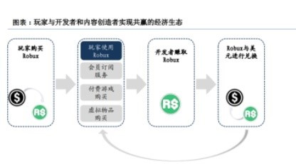
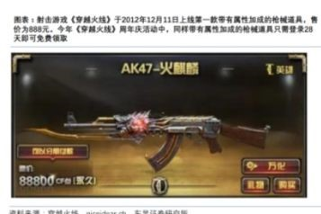
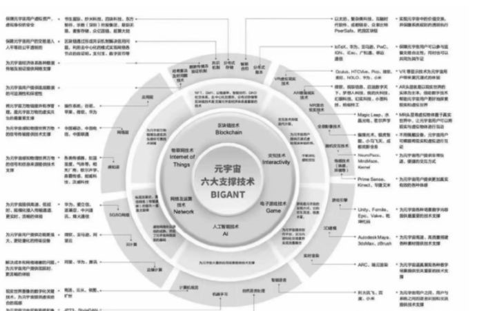
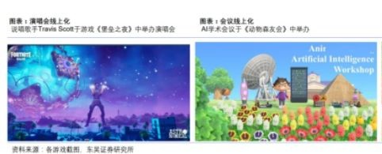
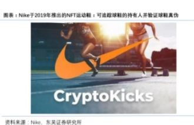
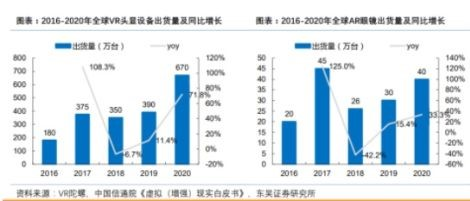
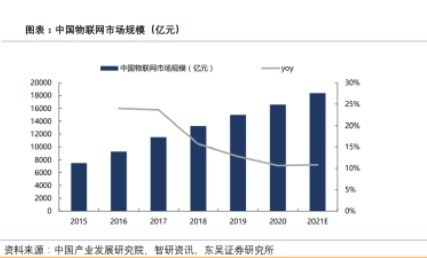
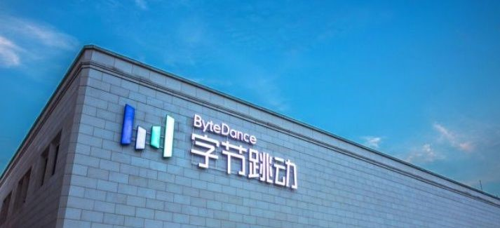
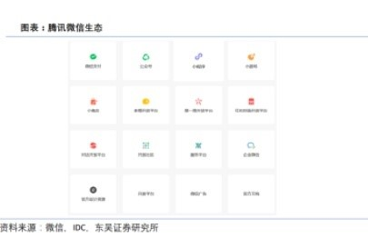
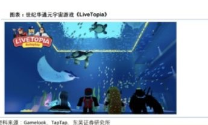

## 一. Metaverse元宇宙：Web3.0,现实与虚拟世界的交织

**1.1 Metaverse元宇宙：现实与虚拟世界互相平行、相互影响**

Metaverse译为元宇宙，是由meta（超越）和取自universe（宇宙）的verse两个单词组合，此概念出自尼尔·斯蒂芬森(Neal Stephenson)1992年发布的科幻小说《雪崩》。

元宇宙可以看做是当前存在的延伸，是一个脱胎于现实世界，又与之平行、相互影响的在线虚拟世界，是互联网下一个阶段的发展方向。人们可以通过虚拟形象在元宇宙内生活，其中有完整的经济和社会系统。

元宇宙是指一个基于信息革命（5G）、互联网革命（Web3.0）、AR、VR等多个通讯与虚拟技术革命结合的线上平台。元宇宙包含了游戏、社交网络、广告营销、影视娱乐等内容，将成为传媒最大的应用场景。

从2016年的VR元年到2019年5G应用的落地，元宇宙的基础设施逐渐成型，直至今年区块链发展更为成熟，公链容量提升，去中心化概念普及，实现了元宇宙独特的经济系统，补全了元宇宙发展的关键要素，促进了元宇宙的发展。

Roblox是首家在招股书中提到元宇宙的公司，并提出了“元宇宙”的8大要素，即身份、朋友、沉浸感、低延迟、多样性、随地、经济、文明。

**1.2 Metaverse元宇宙特质：用户共创内容模式**

短期内，元宇宙依赖于UGC（用户生成内容）维持边界扩张，使得内容生产速度大于消耗速度。

内容生产可分为四个阶段：专业生产内容,用户生产内容，AI辅助用户生产内容，纯AI创作。

传统游戏主要以专业生产内容支撑，开发成本昂贵，以MMO游戏《星球大战：旧共和国》 为例，其研发资金超2亿美元，且PGC的长周期生产难以匹配用户的消耗速度，因此大规模高效率的内容产出需依赖UGC。以Roblox为例，部分内容是由创作者通过Roblox创作工具在其平台上创作并发布。

**长期而言，AI辅助将提高UGC质量与数量，为元宇宙带来长期生命力。**

受限于用户使用相关工具的技术与编程能力，截至2021年9月，无论是视频平台YouTube还是3D引擎类平台，其内容生产者数量远低于消费者，因而仅依靠UGC难以满足元宇宙长时间的内容消耗，内容生产必然步入AI辅助与纯AI创作阶段。

AI辅助通过AI完成代码、绘图、建模等工作，降低内容创作门槛，将有效提高UGC数量与质量，为元宇宙注入活力。

**1.3 Metaverse元宇宙特质：多元化的角色扮演体验**

不同于传统游戏简单的角色服饰外观改变，重复进行相同的游戏内容，在元宇宙中，用户可以通过改变自身形象，以多样的角色和自我认同感体验不同的游戏内容。

Z世代在互联网时代长大，崇尚个性自由，强调身份认同感。

YOLO（You Only Live Once)文化，直译为你只活一次，是一种注重体验，注重自我生活的世界观。

随着YOLO文化的兴起，当代年轻人开始重新审视自我，而元宇宙的身份机制成为用户的大型“假面舞会”，让用户可以切换不同的身份，代入角色，在元宇宙中浸入式体验“第二人生”。

**1.4 Metaverse元宇宙特质：自有经济系统**

在传统金融体系中，信任建立以法律和制度为保障，运行成本高，而中介机构在其中扮演着很重要的角色，存在一定的潜在风险。

元宇宙作为现实世界的映射，需要构建独立的经济系统，还需要与现实经济体系形成关联。

在传统中心化游戏中，经济系统完全依赖于运营者水平，往往采用非透明的经济系统，氪金玩家可以通过对非氪金玩家的装备碾压获得快感，但同时也被游戏中无限的通胀反噬，难以做到长期的调整平衡。

区块链的出现保证了虚拟物品的流转能够去中心化地独立存在，且代码开源保证规则公平、透明，从而极大地降低交易执行时的信任成本，提高资源配置效率。

**价值可以通过智能合约的形式在区块链网络中流通。**

DeFi系统利用智能合约让数字资产在区块链网络中重建传统金融秩序，并且互相产生协同效应。因此智能合约、DeFi的出现将真实世界的金融行为映射到了数字世界，区块链为元宇宙打造了独特的价值传输模版。

**1.5 Metaverse元宇宙特质：虚拟与现实世界的交融**

元宇宙是基于现实世界的虚拟空间，在虚拟世界中搭建社交、生活、甚至经济系统，实现现实世界和虚拟世界的融合。根据Pulsar，元宇宙将会是虚拟世界、电子商务、去中心化技术和社交媒体。

**元宇宙发展预计将经历两个阶段：**

各公司搭建“分布式”的虚拟平台。消费、教育、会议、工作等行为将转移至虚拟世界，但玩家无法进行跨平台操作，只能在一个平台中使用该平台的资产或进行社交。

各平台在标准协议下将交互、经济等接口统一标准化形成互联互通，成为真正的元宇宙。

## 二.元宇宙的构成要素：应用场景与支撑技术

**2 元宇宙BIGANT六大技术全景图**

**2.1 游戏：或成为元宇宙最初落地场景**

游戏被普遍认为是元宇宙的最初入口，其给予玩家虚拟身份，且玩家可依托该身份在游戏内进行社交，初具元宇宙雏形。

疫情催化下，诸多现实生活中的活动转至线上虚拟体验，游戏与现实世界的边界日渐淡化。

2020年4月美国说唱歌手Travis Scott在第三人称射击游戏《堡垒之夜》中举办演唱会，共吸引了1230万玩家同时在线观看；

同年另一说唱歌手Lil Nas X在《Roblox》上举办演唱会，超3000万粉丝参加，玩家可在数字商店中解锁特殊的Lil Nas X商品，例如数字替身、纪念商品和表情包等；

UC Berkeley等高校在Minecraft中举办毕业典礼；《动物森友会》于2020年举办首届AI学术会议；

2021年Gucci与Roblox合作推出“The Gucci Garden Experience”虚拟展览，玩家可欣赏展览并选购虚拟单品，娱乐、消费、工作会议等现实活动通过游戏实现沉浸式体验。

但游戏相比元宇宙仍有较大差距，具体体现在沉浸感、低延迟、随地、自有经济系统等，因此底层技术进步是游戏至元宇宙成熟形态的必经之路。

**2.2 区块链：底层架构实现去中心化经济系统**

《堡垒之夜》的创造者“虚拟引擎之父” Tim Sweeney：区块链技术和NFT是通向完全新兴的元宇宙（虚拟世界）的“最合理的途径。元宇宙要求构建自有独立经济系统，区块链技术通过智能合约等可实现元宇宙内的价值流转，保障系统规则的透明高效执行。

**中国通信工业协会区块链专委会轮值主席于佳宁：NFT是新价值革命载体。**

NFT作为一种非同质化通证，每个NFT独一无二且不可分割。从技术上看，NFT是基于区块链发行，因此权属清晰、转让留痕，实现了数字所有权和可验证性。从应用场景上看，NFT有望成为元宇宙中数字资产的价值载体，从而用户可真正拥有虚拟物品所有权，同时NFT可实现各子宇宙之间的资产流转互通，为多平台互通打下基础。

**Decentraland：基于以太坊区块链的虚拟世界，玩家真正拥有数字资产的所有权。**

Decentraland创立于2017年9月，是第一个完全去中心化的虚拟世界，为用户提供社交、娱乐、消费等活动场景。

Decentraland最大的价值在于虚拟土地的数字资产化，用户可通过区块链平台购买虚拟 地块（LAND，以太坊智能合约维护的NFT），自由展开建设

**2.3 网络及运算技术：5G/6G与边缘计算实现低延迟**

元宇宙要求高同步低延时，从而用户可以获得实时、流畅的完美体验。

回顾在线实时娱乐发展历程，时延缩短使得早期的单向直播逐渐发展至线上语音连麦等实时互动。

根据独立第三方网络测试机构Open Signal的测试数据，4G LTE的端到端时延可达98毫秒，满足视频会议、线上课堂等场景的互动需求，但远不能满足元宇宙对于低时延的严苛要求。VR设备一大难题是传输时延造成的眩晕感，其指标为转动头部到转动画面的延迟，5G带宽与传输速率的提升能有效改善时延并降低眩晕感。

根据诺基亚贝尔数据，5G端到端时延可控制在10ms以内。元宇宙中需对大量数据进行迅速传输，需依赖强大的通讯基础设施。受限于基站数量，5G实际传输速率或难以达到其设计水平，而根据日韩对6G网络技术的展望，6G时延有望缩短至5G的十分之一，传输速率有望达到5G的50倍，有望真正实现元宇宙低延迟的关键特征。

此外，边缘计算常被认为是元宇宙的关键基建，通过在数据源头的附近采用开放平台，就近直接提供最近端的服务，从而帮助终端用户补足本地算力，提升处理效率，尽可能降低网络延迟和网络拥堵风险。

**2.3 网络及运算技术：云计算实现随时随地接入**

元宇宙要求用户可使用任何设备登录，随时随地沉浸其中，要求实时监测数据并进行大量计算，单个或少数服务器难以支撑元宇宙的庞大运算量。云计算作为分布式计算的一种，其强大的计算能力有望支撑大量用户同时在线。

**云游戏作为云计算在游戏领域的尝试，或是元宇宙雏形。**

通过云端强大的算力，云游戏可将渲染等过程转移至云端进行，相比于游戏于终端运行，云游戏极大降低了游戏对终端设备性能的依赖，实现随点随玩，符合元宇宙随时随地接入的特点。

**终端设备性能突破与轻量化：**

VR设备需要高性能CPU、存储传输等部件以支持运算，导致设备重量较重，用户难以长时间佩戴。市面上主流的VR终端设备重量处于500g左右，且体积较大，以出货量市占率第一的Oculus为例（Counterpoint的数据，统计区间为2020Q1-2021Q1），其在2020年推出的Oculus Quest 2头盔重量为503g，体积为191.5毫米x102毫米x142.5毫米。

随着VR设备算力的云化，VR终端设备有望变得更轻便，成本也有望继续下探，加快设备普及。同时云端的强运算能力使VR设备的图像流畅度更高，提升用户体验感。

**2.4 交互技术：提高用户沉浸感，元宇宙必经之路**

**沉浸感提升之路道阻且长：**

**从键盘+鼠标到VR游戏：**

从早期的鼠标、键盘到现在的VR/AR设备，游戏的操作模式不断演变，其沉浸感也不断提升。2020年Valve发布首款3A级VR游戏《半衰期：爱莉克斯》，玩家需要在场景中翻箱倒柜寻找关键道具，可与游戏内几乎任何物体进行交互（比如拿起并投掷物体）。但《半衰期：爱莉克斯》仅支持一定自由度的手部互动，玩家视角中仅可看到手。

**深度沉浸：**

《头号玩家》中玩家通过VR及可穿戴式设备进入游戏，体验真实互动。通过体感衣，玩家可以感受到身体所受攻击的痛感；通过全自动触觉椅，玩家可以体验到游戏中的坠落飞行等体感，通过多款设备采集玩家信息并向玩家实时输出反馈信息，玩家在虚拟空间中的映射感更真实，从而获得身临其境式体验。

**终极形态：**

通过脑机接口技术，实现嗅觉、味觉等感知体验，同时与虚拟世界自由交互，显著提升拟真体验与沉浸感。

**2.4 交互技术：VR/AR设备出货量稳步增长**

技术逐渐成熟，消费级产品价格不断下降。

2012年谷歌推出Google Glass一代眼镜，2013年Facebook以20亿美元收购Oculus，并于同年发布Oculus Rift第二版开发套件，随后索尼、三星、HTC等大厂也相继推出相关产品。

2016年索尼，HTC、Oculus推出第一代消费者版本的VR设备PSVR、HTC Vive、Oculus Rift，受限于内容与生态系统，当时VR/AR设备并未普及。

伴随着5G全球布局，VR/AR行业迎来技术迭代更新，2019年VR一体机Oculus Quest上市，售价降至399美元，2021年9月小米发布单目光波导AR智能眼镜，苹果首款AR/VR设备也有望于2022年上线。

**随着内容日渐丰富，全球VR/AR设备出货量稳步增长，产业将迈入深度沉浸阶段。**

VR设备方面，受《半衰期：爱莉克斯》等VR内容发布及产品价格不断下探影响，2020年全球VR头显设备出货量大幅上涨，达到670万台（yoy+72%）；AR方面，AR眼镜出货量达40万台（yoy+33%）。

根据VR陀螺预测，VR软硬件生态已步入拐点，而AR产业因价格未达到消费级水平，截至目前（2021年9月）仍主要应用于B端，未来发展取决于功耗、重量等难题攻克。

而根据中国信通院发布的《虚拟（增强）现实白皮书（2017年）》，2022年VR/AR产业将正式步入深度沉浸阶段，技术升级有望驱动硬件设备市场渗透率不断提升。

**2.5 人工智能：构建虚拟世界的支撑技术**

AI为元宇宙应用场景提供支撑：计算机视觉、机器学习、自然语言处理和智能语音的发展进步为元宇宙提供了虚实结合的观感，使元宇宙具备多元性与沉浸感。根据艾瑞咨询数据，2019年中国人工智能核心/带动产业规模分别为1088.6/3821.5亿元，艾瑞咨询预计至2025年复合增长率分别为27%/28%。

**AI支撑内容生产以满足消耗：**

元宇宙必须具备丰富的内容以保持玩家的探索欲望，而依赖PGC和UGC远远不够，以开放世界游戏为例，研发耗时8年的《荒野大镖客：救赎2》中玩家主线游玩时长仅为41.5小时，《原神》版本更新后很快便进入“长草期”。

人工智能可支撑用户高效生产高质量内容，以Epic于近两年推出的产品为例，2021年推出的Metahuman Creator工具可制作高度逼真人脸，用户可基于近傻瓜式的交互方式，以极大自由度高速创建高保真数字人类，然后导出并下载至虚幻引擎中制作动画，在不牺牲质量的前提下，将制作3D虚拟角色模型的时间从数周、数月缩短至一小时内；2020年推出的《Live Link Face》利用苹果智能手机实现人脸动作捕捉并导入至虚幻引擎中。

我们预计随着AI技术进步，内容制作门槛将不断下降，内容产出效率将不断提升，为元宇宙注入源源不断的活力。

**2.6 物联网技术：满足多元化方式接入元宇宙需求**

物联网技术能够满足随时随地以各种方式接入元宇宙的要求，同时为元宇宙感知外部信息来源提供支撑。元宇宙的要求之一就是便捷的访问方式，因此人们与互联网交互的方式将不局限于移动手机和电脑，各种穿戴设备、汽车、家居等都将接入网络中。此外，物联网传感器是人类五官的延长，能够确保元宇宙世界捕获更多的外界信息。

**全球物联网核心技术持续发展，产业体系处于建立和完善过程中。**

截至2020年底，中国物联网市场规模达到16600亿元，较上年增加1600亿元，同比增长10.67%。

全产业链可大致分为四层：感知层、网络层、平台层和应用层，其中感知层中的芯片等产品主要由国际厂商主导，将有望实现国产化替代，平台层是物联网提供应用及增值服务的基础，下游智能驾驶、智能家居等应用层的场景逐渐丰富，能够带动平台层、网络层的增长。

因此从供需两端来看，我国物联网行业的原材料价格有望持续下降，同时需求端不断增加，有望实现市场规模的不断扩张。

## 三.元宇宙行业机会

**3.1 大厂加码布局元宇宙**

随着技术和应用的逐渐成熟，Facebook、腾讯、字节跳动等互联网巨头加码布局元宇宙。

Facebook创始人兼CEO马克-扎克伯格此前表示未来五年内（2022-2026年）Facebook将从一家社交媒体公司过渡到一家元宇宙公司。

公司在此前便已经进行了VR/AR领域布局，根据SuperData2020Q4报告，Facebook旗下VR品牌Oculus占据市场主要份额，其中Oculus Quest 2销量超过了100万台，排在第二的PlayStation VR销量仅为12.5万台。

此外，公司还收购了包括BigBox VR等一系列VR游戏工作室。

腾讯则在2020年2月Roblox 1.5亿美元G轮融资中参投，并独家代理Roblox中国区产品发行。

2021年4月，字节跳动花费1亿元投资游戏厂商代码乾坤，其产品有具备元宇宙雏形的青少年创造和社交UGC平台《重启世界》。

8月29日，字节跳动收购专注于移动VR一体机市场的公司Pico，其技术除消费场景外在培训、医疗、展览展示等场景下也已经得到应用。

同时，字节在海外还推出了一款名为Pixsoul的元宇宙社交app，可以通过AI技术复刻与本人相像的虚拟形象。

**3.2 从应用场景和支撑技术两大主线把握元宇宙行业机会**

从元宇宙的构成要素来看，我们认为可以从应用场景和支撑技术两大主线把握元宇宙投资机会。

游戏是元宇宙应用场景的先行者，应用层面当前重点关注游戏领域。游戏反映的是元宇宙的雏形，是人类对虚拟世界的构想，在当前元宇宙发展的早期阶段，游戏是应用场景中的先行者。

Roblox作为元宇宙第一股，基于UGC的内容创作模式已经初具元宇宙雏形，2021Q2 Roblox营业收入达4.54亿美元，同比增长127%，国内来看，腾讯作为最大的游戏厂商，在最适合元宇宙游戏的社交竞技类赛道中具有长期竞争力。

此外，宝通科技、世纪华通、中青宝等其他游戏厂商也纷纷入局，尝试通过开发VR游戏、将游戏产品与NFT结合以及开发基于Roblox平台的游戏等方式积极探索元宇宙。

**医疗、教育、金融、社交等领域的全方位应用将带来更多机会。**

元宇宙始于游戏，但覆盖场景将远高于游戏，例如更加真实的社交 体验，能够获得更好互动体验的线上会议和授课，以及医疗场景中能够解决更加精密复杂的手术、实现远程问诊等，但现阶段仍需等待 技术端的完善，相关投资机会值得关注。

元宇宙几大支撑技术包括交互技术、区块链技术、人工智能技术、网络及运算技术、物联网技术等。

**交互技术领域的VR/AR设备龙头及相关解决方案提供商。**

推荐VR设备代工龙头歌尔股份，VR/AR数字视觉内容和整体解决方案提供商风语筑等。VR/AR设备出货量处于高速增长阶段，2020年全球VR头显设备出货量670万台，同比增长71.8%，歌尔股份作为市占率第一的Oculus系列产品代工方，2021年上半年智能硬件营收同比增速高达211%。

人工智能技术包括计算机视觉、智能语音语义、机器学习几大板块，相关标的包括科大讯飞、商汤科技等。近几年随着算力水平的增加以及垂直应用的落地，市场规模快速增长，国内来看，政策红利以及AI公司的加速上市同样带来了较多投资机会。

**网络及运算技术领域关注5G和云计算相关标的。**

推荐5G设备供应商中兴通讯，云计算厂商优刻得等，建议关注网宿科技等。在政策支 持背景下行业发展迅速，中国5G基站建设和网络覆盖均处于世界领先水平，三大运营商的相关投资不断增加，5G网络渗透率也在持续 提升。云计算在 2021年初已建立了完整的产业链，国资云加码有望提升产业链需求。

物联网技术领域推荐中科创达等。据艾瑞咨询数据，2020年中国物联网设备连接量达74亿个，艾瑞咨询预计2025年将突破150亿个，受益于5G网络的普及和云计算技术的提升，行业整体保持着稳定的增长速度。

**3.3 Roblox：元宇宙第一股**

Roblox是一款全球最大的大型多人在线创作游戏平台，玩家可以使用专有的引擎平台Roblox Studio来创建自己的游戏，并供其他玩家游玩。Roblox平台有自己的经济系统，并可以满足玩家娱乐，社交等需求。

平台游戏有模拟类（如《Natural Disaster Survival》），生活方式类（如《Adopt Me》），益智解谜类（如《Murder Mystery 2》）等代表作品，其中《Adopt me》的Roblox官网关注量已经达到了2160万。

2021Q2 Roblox营业收入为4.54亿美元，同比增长127%，环比增长17%；净亏损1.40亿美元，去年同期净亏损为0.72亿美元；21Q2 DAU达到4320万，同比增长29%，用户总参与时长为97亿小时，同比增长13%。

**3.3 Roblox：基于独特经济系统的UGC游戏平台**

Robux是Roblox世界中的唯一货币，所有Roblox世界中的非免费物品都可以用Robux进行交易。

Robux可以和美元自由兑换，每个Robux价值0.0035美元（2021.09数据）。

玩家可以使用Robux从Avatar Marketplace(游戏商城)购买衣服、配饰和表情等物品，也可以支付Robux解锁新的游戏功能，获得更加深入的游戏体验，例如支付100Robux，会员用户可以创建一个群组；支付1000Robux，用户可以修改用户名。

在内容创作模式上，Roblox以UGC为主，大大降低了创作的门槛，基于Robux的经济系统也能给予创作者丰厚的回报。平台为游戏开发者支付的费用在不断增加，2021Q2高达1.30亿美元。

2020年有超过1300个游戏产生至少100万小时的参与时间，超过17000个游戏产生超过一万小时的参与时间。

这些游戏创作者也相应取得了巨额的收入激励，2020年平台开发者收入达3.29亿美元。

UGC模式使游戏开发者和游戏玩家相互转化，形成闭环，使玩家自我满足，不断驱动高质量游戏内容生产，玩家和开发者的积极性也被充分调动。

**3.4 腾讯：从游戏出发全方位布局元宇宙**

腾讯是元宇宙赛道的首推标的，作为游戏行业的龙头公司，腾讯具有从游戏出发全方位布局的能力。2020年末，马化腾在腾讯出品的年 度特刊中提到了“全真互联网”的概念，指明了公司下一阶段的发展目标。 

**腾讯从游戏出发布局元宇宙具有独特优势，**

1）公司具有强研发实力同时擅长大DAU的社交+竞技品类，头部产品《王者荣耀》《和平 精英》长期表现良好为公司提供了丰富经验，此外，公司还与Roblox成立合资公司罗布乐思，将其引入中国。

2）拥有能够支持高品质内容的游戏引擎，腾讯除了自有引擎Quicksilver，同时持有Epic40%股份，其虚幻引擎已成为《堡垒之夜》等多款大型游戏的开发工具。

3）腾讯围绕游戏打造了包括直播、电竞在内的生态闭环，是形成元宇宙的良好基础。

4）公司对VR游戏公司Frontier Development、威魔纪元等也进行了投资，围绕元宇宙形成了丰富的产品线。

**腾讯围绕元宇宙不断进行全产业链布局。**

一方面微信作为腾讯的核心产品，围绕社交形成了包含电商、游戏、支付、生活服务在内的完 整生态，已具备元宇宙雏形。

另一方面，腾讯在云、人工智能、AIoT、边缘计算等技术领域持续投入，在转型产业互联网后，腾讯云发 展迅速，截至2020年上半年在国内厂商中份额排名第二，是中国首家服务器总量超过百万的公司，也是全球五家服务器数量过百万的公 司之一，在加强基础设施建设的同时利用好腾讯生态的优势，为游戏、教育、智慧医疗、智慧城市等垂直领域提供解决方案。

人工智能方面，2020年5月腾讯云AI客户数超过200万，服务全球用户数量更是超过12亿，腾讯在人工智能领域已探索了内容、游戏、社交和平台工具型四类AI，打造出围棋AI“绝艺”，并取得了多项比赛冠军。

**3.5 其他游戏厂商：探索元宇宙游戏的产品形式**

**宝通科技：**

公司在VR/AR领域投资了智能眼镜公司TopSmart、哈视奇等企业，2021年9月1日完成对一隅千象战略级投资，将为自研游戏《终末阵线》打造 裸眼AR。

公司将哈视奇作为内容研发商，将一隅千象作为产品内容载体，逐步打造工业智能领域的闭环。此外，2021年9月10日宝通科技增资子公司海南 元宇宙科技有限公司至5000万元，用于支持其开展新兴产业布局，重点布局AR/VR/MR、机器人、传感器、新能源矿卡、高端装备等成长性产业。

**世纪华通：**

旗下点点互动自研元宇宙游戏《LiveTopia》自2021年4月28日上线Roblox平台以来，不到5个月时间，成为Roblox CEO在第二季度财报中特别提到的现象级游戏，月活跃用户超4000万，最高日活突破500万。同时公司在VR/AR领域也持续加码投资，通过VR游戏筛查阿尔茨海默症，以及在红色文化展览中增加参观者的观展体验。

**中青宝：**

公司即将推出的《酿酒大师》是一款模拟经营类元宇宙游戏，游戏中玩家自己“亲手”酿的酒，可以在线下提酒，合作酒厂为知名白酒品牌，通过国际白酒品鉴师为白酒鉴定，最终给出官方认证。

另外酒厂品牌将会获得NFT认证，玩家可以通过圈子内部拍卖获得收益，也可以映射到链上，在更大的平台进行拍卖交易

**3.6 技术厂商：相关技术领域龙头**

元宇宙的支撑技术包括交互技术、区块链技术、人工智能技术、网络及运算技术、物联网技术等。

相关标的：VR设备代工龙头歌尔股份，VR/AR数字视觉内容和整体解决方案提供商风语筑，5G设备供应商中兴通讯，国内领先的第三方云计算服务商优刻得，国内领先的定制化IDC服务商数据港等，物联网相关标的美格智能等。

## 四.风险提示

元宇宙的发展仍处于较早期阶段，技术研发所需时间仍有不确定性。

元宇宙概念的虚拟现实相关产业存在法律监管盲区，可能会有不确定性的法律监管风险。 市场竞争加剧致使收益不及市场预期。

全球新冠疫情的反复可能对业务和运营产生重大影响。

市场系统性风险：科技股弹性及估值较高，若流动性及市场环境出现变化，可能出现股价回调风险。