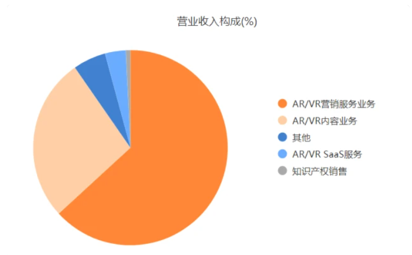
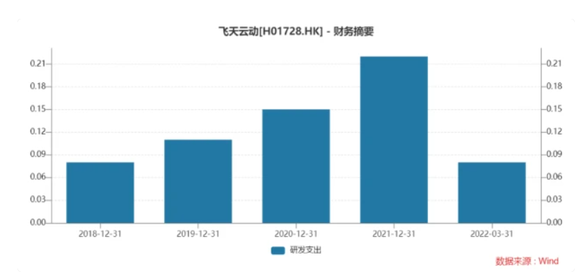

元宇宙热度不减，元宇宙概念股IPO前仆后继。

日前，“国内元宇宙第一股”的飞天云动更新了招股书，赴港上市再次被提上日程。

据悉，原名“掌中飞天科技”的飞天云动，最初为游戏发行平台，曾于2017年7月14日在新三板上市。2019年，公司完成向AR/VR内容及服务业务的转型，并于当年8月9日申请于新三板摘牌，摘牌前市值约为3.5亿元。在递交招股书的前一个月，掌中飞天科技改名为飞天云动。

近年来元宇宙概念大火，让资本市场闻风而动，投资机构纷纷抢筹。招股书显示，新业务转型以来，飞天云动先后进行了五轮融资，投资方包括同创伟业、大运河（南京）基金、赛富动势、泰豪投资等机构。

飞天云动在招股书中称，公司致力经营中国领先的元宇宙平台，通过连接中小企业公司与元宇宙、建立公司自己的飞天元宇宙平台，为商业客户提供服务。然而，业内人士指出，国内元宇宙仍处于发展早期，技术和政策监管等方面存在诸多不确定性，需警惕概念炒作风险。

**游戏公司转型做AR/VR**

成立于2008年3月的飞天云动，前身是北京掌中飞天科技股份有限公司，起初是一家游戏发行平台。

招股书显示，飞天云动于2017年由游戏业务转向AR/VR内容及服务业务，并于2019年完成转型。2017年公司推出首个AR/VR SaaS平台，并于2019年产生来自AR/VR SaaS业务的收入。

根据中国信通院的预测，2022年VR/AR产业将正式步入深度沉浸阶段，技术升级有望驱动硬件设备市场渗透率不断提升。

艾瑞咨询数据显示，2021年中国AR/VR内容及服务的市场规模（按收入计）为人民币217亿元，预期将由2022年的人民币357亿元增加至2026年的人民币1302亿元，复合年增长率为38.2%。

目前，飞天云动主营业务包括AR/VR营销服务、AR/VR内容、AR/VR SaaS及IP业务。2019-2021年，公司分别实现营业收入2.51亿元、3.39亿元和5.95亿元，毛利率分别为30.0%、30.9%和29.5%

其中，AR/VR营销服务是公司的主要收入来源。2019-2021年，该公司AR/VR营销服务分别实现收入1.37亿元、1.42亿元和3.76亿元，占公司总收入的比例分别为54.6%、41.9%和63.2%。

飞天云动主营业务收入占比，来源：Choice数据

不过，对公司收入贡献度最高的AR/VR营销服务，其毛利率却远低于其他业务，甚至拖累公司整体毛利率水平。

数据显示，2019-2021年，公司AR/VR营销服务的毛利率分别为21.2%、19.4%、21.7%；而同期AR/VR内容和AR/VRSaaS业务的毛利率都在50%左右。

**研发投入偏低，先发优势不明**

早在2021年11月，飞天云动宣布即将发布飞天元宇宙平台。

“在向沉浸式方向发展的过程中，AR/VR终端会成为元宇宙的第一入口。”资料显示，元宇宙平台的要素主要包括沉浸式体验、社交渠道、商务功能及用户自行开发能力。此外，元宇宙平台还同时为商户和消费者提供切合彼等进行商业互动的虚拟空间。

业内人士曾告诉钛媒体App，国内虚拟现实产业起步较晚，AR/VR设计、研发、产业化等方面人才缺乏严重。
据招股书披露，飞天云动的AR/VR技术，包括底层技术、内容技术和平台技术，涵盖及支撑其AR/VR业务。全面的AR/VR技术及富有经验的研发团队，是飞天云动持续扩展业务的核心竞争力。

该公司同时指出，中国的AR/VR内容及服务市场相对分散，市场参与者超过5,000名。由于元宇宙具有技术及标准快速演进的特点，一旦竞争对手获得具有替代性的技术标准，那么公司的在行业内的竞争优势会大大降低。

飞天云动在研发方面的投入开支并不算亮眼。招股书显示，2019-2021年，公司研发开支分别约为1140万元、1500万元和2170万元，分别占当期营业收入的4.6%、4.4%和3.6%，整体占比呈下降趋势。

飞天云动研发支出，来源：Wind

与全球范围内元宇宙第一股Roblox相比，飞天云动的研发占比偏低。

Choice数据显示，Roblox 2019-2021年研发支出分别为7.14亿元、13.43亿元和35.55亿元，分别占当期营业收入的21.9%、21.8%和27.8%。

东吴证券研报指出，国内元宇宙产业发展仍处于早期阶段，技术研发所需时间具有不确定性，技术路线尚未确定，尚不存在先发优势，相关公司存在炒作概念风险。

**客户为广告服务商，流量获取成本高**

所谓VR是利用电脑模拟创建一个三维空间的虚拟世界，是一种多元信息融合的、交互式三维动态实景和实体行为的系统仿真，可以让用户如同身临其境一般，及时无限制地观察三度空间内的实物。

AR可理解为“真实世界+数字化信息”，是一种将计算机构建的虚拟物体、场景或系统提示信息叠加到真实场景之上的技术，可为用户实时地提供一个虚实融合沉浸式的体验。

飞天云动表示，作为中国最早进入AR/VR内容及服务市场的公司之一，公司在AR/VR交互内容制作方面已积累多年的经验，且拥有广泛的行业客户覆盖范围。

招股书披露，2019-2021年，来自五大客户的收入分别占同期总收入的约46.1%、38.5%和39.2%；来自最大客户的收入分别占同期总收入的约12.0%、14.2%和10.2%。

据悉，飞天云动AR/VR营销服务客户主要为广告主及其代理；AR/VR内容客户主要为来自娱乐、教育、文旅、技术、保健及汽车等行业的公司；AR/VR SaaS客户主要为定制AR/VR SaaS解决方桉客户及AR/VR SaaS平台付费订购用户。

此外，2019-2021年，公司五大供应商分别占总收入成本约49.9%、41.1%、45.1%。其中，最大供应商分别占公司总收入成本约16.1%、9.7%、13.5%。

艾瑞咨询数据显示，传统形式广告的点击转化率介乎0.3%至15%，而AR/VR广告者则高达25%。

飞天云动的流量获取成本较高。据悉，该公司以CPA、CPC或CPM定价模式向媒体平台或其代理支付流量获取成本，以便投放广告。

截至2019年、2020年及2021年12月31日止年度及截至2022年3月31日止三个月，公司流量获取成本分别为1.15亿元、1.38亿元、3.12亿元及1.27亿元，占同期总收入成本的65.6%、59.2%、74.2%及81.5%。

此外，飞天云动还就广告流量获取向主要供应商支付大额预付款项。截至2019年、2020年及2021年12月31日及2022年3月31日，用于获取广告流量的预付款项金额分别为4470万元、8590万元、13840万元及17150万元。