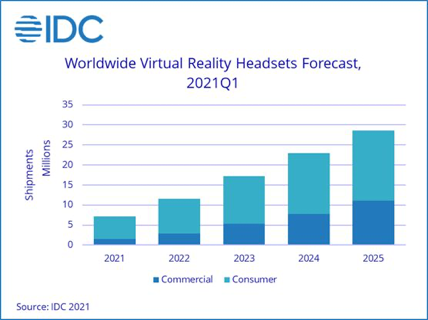
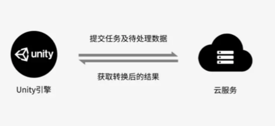

# 元宇宙带来的三个发展趋势

#### 加速新的技术发展

元宇宙是非常前沿的科技产物，是当下多种尖端科技的超级综合体，实现元宇宙的功能需要多种前沿技术的极大发展和应用。例如，我们需要人工智能技术来监管信息，否则就容易成为有害信息的温床;需要成熟的区块链机制来储存且认证身份;数据计算涉及到了云计算、边缘计算;数据传输涉及到了5G网络;展示元宇宙需要虚拟现实技术等。除了上述技术，元宇宙还需要其他的例如3D渲染、拓展现实、脑机接口、可穿戴、机器人技术等。虽然这些技术的部署尚未到位，但都在近期得到了高速发展，许多大企业都纷纷入局抢占位置。随着诸多企业的入驻，这些技术都将得到很大的推广和应用，随着这些技术的逐步成熟，元宇宙落地的可能性增加了许多。

例如在5G方面，全世界都在加紧步伐，布局相关的基础设施。元宇宙需要非常快速的数据传输，而5G则是实现的手段。各国积极投入5G相关设施，为元宇宙打下了很好的基础。许多公司也在积极开发相关的技术、专利等等，例如高通、诺基亚等。国内的电信运营商例如中国电信等都宣布未来将会提供元宇宙的数字基础设施。这些公司的积极投入都将会使得元宇宙成为可能。

虚拟现实(VR/AR)是个将元宇宙展示给人们的技术，许多知名公司都积极布局了此领域。例如Meta公司推出的Oculus Quest 2售价299美元，得到了许多人的好评。微软也有自己的VR/AR设备。腾讯与字节跳动更是为了VR设备制造公司Pico大打出手，最后由字节跳动成功购买。苹果更是传闻2022年会推出相关的设备。许多公司的入局都让虚拟现实行业更快速的发展，相信未来虚拟现实会是一个非常成熟的行业。

据IDC数据显示，全球VR设备出货量正在提速，预计2021-2025年全球VR头显出货量将保持41%的年复合增速，预计2021年的出货量将由2020年的670万台提升到850万台，2025年更是将达到2860万台。

全球预计每年VR/AR设备出货量

此前，技术受限、糟糕的用户体验和缺乏生态系统等问题成为了VR/AR产业发展的拦路虎。汇丰发布报告《Virtual reality reaches a tipping point》指出，上述问题将逐步得到改善。例如2020年之前，VR/AR的软件还不够成熟，且平台非常有限，只有Steam、Oculus PC和Vive Port三家独大，甚至连可玩的游戏或应用程序也极少。而2020年之后，Pico、Side Quest、APP Lab和Oculus Quest相继推出平台，同时开发商大力扩展应用程序项目，其中Steam如今有超6000多个VR应用程序。

虚拟现实行业的蓬勃发展让元宇宙逐渐成为了现实。除了虚拟现实之外，其他技术领域也得到了很多的重视。例如英伟达积极布局元宇宙相关的芯片、元宇宙渲染平台等等，力求成为元宇宙的基础建设者。Unity则是积极布局3D渲染以及元宇宙云计算。以上领域的蓬勃发展都意味着技术、相关产品的逐渐到位，这些都促使了元宇宙的大热。

今天，随着5G通信网络、VR/AR为代表的终端交互技术，以及边缘计算和智能计算中心的建设和发展，也必将会带来新一轮的科技变革。

#### 计算的升级

元宇宙中有大量的程序需要计算。构成元宇宙的虚拟内容、区块链网络、人工智能技术都离不开算力的支撑。例如元宇宙里建筑的建模、显示就需要大量的算力来进行渲染。及时的信息反馈也需要大量且强大的运算能力。因此越高的算力可以构建出体验感越强的元宇宙。游戏产业每一次重大的飞跃，都源于计算能力和视频处理技术的更新与进步。元宇宙亦是如此。

我们需要人工智能来辅助用户创作，生成更加丰富真实的元宇宙内容。如今是自媒体的时代。许多人都成为自媒体，然而自媒体也有一定的门槛。需要一定的启动资金，前往特定地点拍摄、幕后团队、文案等等。这些都阻挡了一部分人们的创作。在人工智能的帮助下，用户可以在元宇宙中发挥创意自由创作，每个人都可以成为创作者。人工智能可以帮助人们完成写稿、绘图、上字幕、动画等繁重工作。除创作外，在元宇宙内部也会有NPC参与社交活动。这些NPC会有自己的沟通决策能力，从而进一步丰富元宇宙虚拟世界。

除了创作外，元宇宙的其他方面也都需要算力的支撑，可以说算力就是元宇宙的基础设施。在计算方式方面，目前市场主要认为云计算是提升整体元宇宙计算能力的最优方式。依靠普通百姓的计算机设备来运行元宇宙庞大的代码是不现实的，云计算则是一个很好的解决方案。

连接进入元宇宙中，我们需要输入“参数”，即前往哪里，下哪些指令等等，就好比打游戏敲键盘输入指令。人们进入元宇宙中所输入的参数远比敲键盘所产生的的指令要复杂许多，传感设备采集我们的“输入参数”，丢到云端进行运算再转换成元宇宙能理解的参数，从而让元宇宙里虚拟化的我们能够动起来。

人类连接进元宇宙需要得到一定的“反馈”，云技术经过一定的运算之后再把“反馈”传回给我们手边的设备，从而给予我们一定的感知反馈。

Unity 最新推出了“Unity 云端分布式算力方案”。根据Unity官方的说法，该方案可以节省高达 70% 以上的运算时间。在提高整体运算效率的同时，也降低了对本地计算资源的损耗，大大节省了成本。

#### Unity云技术解决方案

除了云计算方面，其他公司例如英伟达、AMD都积极布局了相关的芯片设计或是解决方案。英伟达更是推出了Omniverse平台，希望未来能够成为元宇宙的基建者，为元宇宙提供更加强大的算例。Meta更是与英伟达合作一起开发超级计算机，为未来进军元宇宙铺好道路。

许多公司的抢滩都将会促使如今世界的算力更上一层楼。

#### 商业上的升级

元宇宙本质上仍是互联网，只是内容呈现更加接近现实形态。与互联网类似，元宇宙也将会带来全新的商业模式。此前01区块链发布了《元宇宙中的八个新商业模式》，里面探讨了元宇宙将会如何带来全新的商业模式，当中包括了元宇宙建造服务、广告宣传、元宇宙地产租借、数字收藏品的销售、沉浸式体验与娱乐、新的销售商品方式、元宇宙的数据服务商以及虚拟办公。

人与人之间、人与信息的交换、人与商品/服务的连接与交互是互联网商业化的基础。随着信息入口发生改变(元宇宙的连接方式与互联网不同)，人与人、人与信息、人与商品/服务的连接关系也将发生改变。

当这些关系或场景发生变化，承载在这些连接之上的商业形态也将进行新一轮的颠覆式创新。那么，今天元宇宙的发展趋势下，我们的社交，我们的商务，我们的信息获取方式，以及内容生产和消费都将会涌现出全新的模式。

例如销售商品方面。想象你正和一个朋友在公园里喝咖啡，她推荐了一双运动鞋。一瞬间，鞋子的选项闪现到你的视野中。随着数字图像飘过，款式的详细描述呈现在你眼前。有些细节你不喜欢，你让人工智能助手进行微调。只需一个简单的滑动，你把访问权限授予你的朋友，然后你们一起对花边和颜色进行了调整;再一个手势，你下单了。这周晚些时候，工厂就会按照定制需求发货。

万事达卡创新咨询服务部副总裁 Keith Jordan 说：“未来几年，商业企业和消费者将越来越容易接触到混合现实，从而改变我们的生活。我们将在未来十年的技术变革海啸所带来的范式转变中，穿越这些在不同维度拥有不同体验的混合世界。”

如今的二维电商缺点在于图文不符或是视频按照事先调整好的角度进行拍摄，最终用户买到的产品常常不是理想中的样子。此外，商品不能定制化也是一个问题。企业为了节省制造以及宣发的成本，鲜少会有定制化的商品售卖。

随着元宇宙拉近商家与客户之间的关系，客户可以定制自己的产品。此外，元宇宙里的三维显示也能很大程度上避免了商品图文不符的情况。而随着虚拟世界的蓬勃发展，未来电商也不会局限于售卖实体的物品，虚拟物品会在未来电商世界中占据一定的比例。

除了电商之外，元宇宙也会带来许多不一样的商业模式。元宇宙作为下一代互联网，必然会有更加新颖、意想不到的商业模式。元宇宙也会孵化更多的企业，将元宇宙整体市场做大。元宇宙会在现实世界基础上进一步扩张更多的商业模式。