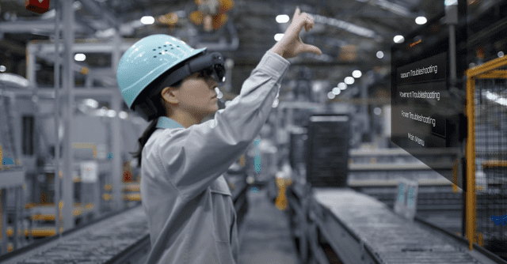

# “工业元宇宙”进行时：英伟达、微软等巨头布局

　　科技巨头微软在元宇宙的最新动向已扩展至工业领域。近日，微软宣布工业机器人领域的世界领先企业川崎重工成为首位使用其“工业元宇宙服务”的客户。

　　据悉，川崎重工将使用微软云计算平台Microsoft Azure和混合显示耳机HoloLens等微软技术产品，来帮助生产、维修和管理供应链。

　　Acumen Research and Consulting近日发布的报告称，预计到2030年，全球元宇宙的市场规模将达到1803亿美元左右；从2022年到2030年，以每年45.8%以上的速度增长。

　　有多位业内人士分析称，工业元宇宙将覆盖从产品设计、生产、巡检、远程运维、经营管理等工业生产全链条环节，元宇宙在工业领域的应用价值或远大于消费领域。

　　踏入工业元宇宙的科技巨头

　　工业元宇宙正在成为现实。从单个螺丝到整个工厂，物理世界的所有细节都能够在虚拟空间中得到复制。

　　“工业元宇宙是一种全新的工业互联网交互模式，将带来开放协作的产业形态和商业模式。”北京信息化和工业化融合服务联盟理事长闫同柱告诉区块链日报记者，工业元宇宙更强调可视化、准确性和调优性，比起构建新的场景和体验而言，工业元宇宙更关注解决确切场景中的确切问题。

　　Industrial metaverse solutions（工业元宇宙解决方案）是微软对于工业元宇宙、数字孪生、自动化控制、工业用AI与工业视觉等所结合起来的统称。

　　川崎重工技术开发部工作人员在微软工业元宇宙项目中表示，在完整的元宇宙世界中，“从开发到设计再到测试，所有过程都可以在虚拟环境中执行”。

　　另一方面，此前一旦生产线出现问题，整个工厂的生产都会停止，直到出故障的地方被修复。

　　在导入微软工业元宇宙系统后，通过Microsoft Azure和混合显示耳机HoloLens，川崎重工的员工能够快速地发现机器人产线的故障问题，并远程与专家连线沟通，或是使用数字孪生技术来模拟现场排除故障。

　　在工业元宇宙中，工厂的变化将触发其数字孪生的等效变化，不仅能同步复制、模拟产线的动态，也将实现生产力的提高。

　　实际上，实现工业元宇宙所需的一些技术包括物联网IoT已经存在多年。诺基亚首席执行官近日在世界经济论坛的一次小组讨论中表示，6G网络将在2030年左右进入市场，而“6G的到来将伴随着工业元宇宙的扩张”。

　　被定位为“工程师的元宇宙”的英伟达Omniverse也是一个用于复杂设计工作流，端到端实时协作和真实仿真平台。

　　闫同柱指出，英伟达工业元宇宙体现在虚拟工厂、虚拟设计、虚拟产品优化、虚拟制造等领域的应用；而微软工业元宇宙的应用领域主要包括沉浸式办公、工作健康管理、安全生产及员工作业指导。

　　“不少的案例都表明工业元宇宙将使工业生产更协同、更高效、更安全、更智能、更精准和更低成本。”

　　截至目前，微软和英伟达的工业元宇宙服务已经吸引了一些著名厂商。除川崎重工外，世界上最大的酿酒商之一百威英博、番茄酱制造商亨氏也是微软工业元宇宙的商业合作伙伴，工业元宇宙在对两家公司供应链优化上起到了相当大的效用。

　　宝马集团则是英伟达Omniverse最大的合作伙伴。通过Omniverse的使用，宝马能够协调全球31座工厂的生产，据悉生产规划效率将因此提高30%。此外，基础设施工程软件公司Bentley利用Omniverse来优化能源基础设施。

##### 国内工业元宇宙的发展现状

　　国内各方也在持续探索工业元宇宙。今年以来，元宇宙已成为多个地方政府的规划重点。上海、广州、无锡、武汉等多地的相关政策显示，地方政府均鼓励元宇宙在包括工业制造、社交娱乐等领域的应用，推动元宇宙与实体经济相融合。

　　值得一提的是，据工业和信息化部工业文化发展中心官方信息，为采用数字技术方式弘扬中国工业精神、传播中国工业文化，该文化发展中心在今年3月表示将筹建工业元宇宙服务平台，并拟于今年推出首批工业文化数字藏品。

　　工信部文化发展中心的工作人员向记者介绍，目前首批工业文化数字藏品素材的征集已截止，但其余批次仍在持续征集中。不过，工业文化数字藏品的推出时间仍未决定。

　　关于工业元宇宙服务平台的详细介绍，其并未进一步回复。

　　从地方层面来看，无锡市一个名为“雪浪云”的工业元宇宙项目近期已获国有资本的青睐。据当地媒体报道，2018年5月成立的雪浪云在今年4月获得无锡太湖湾知识产权股权投资基金的投资。

　　官方介绍称，雪浪云项目是由无锡雪浪数制科技有限公司自研的云原生雪浪OS数据智能系统，该系统能够帮助制造业管理数据，提升制造业的创新能力与优化迭代的速度。

　　记者希望就该系统如何服务于制造业厂商、当前合作对象等问题进一步询问雪浪云方面，但截至发稿未获置评。

　　从各大公司的工业元宇宙进展来看，海尔卡奥斯近日发布了D3OS数字孪生产品，据称其将通过提供数据智能和数字孪生端到端解决方案，助力企业打造可视、可管、可预测的数字孪生虚拟工厂。

　　除此之外，人工智能公司亮风台、工业互联网企业航天云网等公司都正在利用5G、VR/AR、数字孪生等相关技术切入工业元宇宙，但均未大规模展开应用。

　　“元宇宙需要长链接，才能突破边际。”数秦科技创始人、董事长高航告诉记者，只有智能硬件链接终端的公司才能实现，而当前软件公司“要沉淀下来，太难了”。

　　不过，闫同柱认为虽然国内工业元宇宙还属于初期阶段，但与国外的差距不大。“工业元宇宙产业为工业寻找新的增长点提供了很好的思路，成为企业数字化转型的一个新动能，进一步推动工业互联网向纵深发展。”他说道。

　　针对国内外工业元宇宙发展存在的不同之处，中关村大数据产业联盟秘书长赵国栋概括道，“国外企业在技术积累上更深厚，但国内的应用场景会更加丰富”。