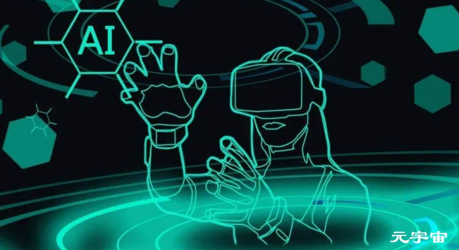

国内的VR之风正吹得愈演愈烈。

去年元宇宙的突然爆发，为已经降温的VR/AR补全了一部分的概念与前景，让虚拟现实大规模地为C端消费者所熟知。字节、爱奇艺等大厂也纷纷踏足了这条赛道。前段时间，有消息称字节跳动已经将前小米VR负责人马杰思招入麾下，将负责字节旗下VR产品Pico的社交业务，直接向负责人周宏伟汇报。

据IDC数据，今年中国VR出货量达到250万台，较2021年增长420%；字节Pico与爱奇艺旗下“奇遇”是最为突出的两家，共同瓜分了超过半数的市场。

但和全球市场相比，国内消费级VR的盘子却显得并不大，甚至有些小。2022年第一季度全球数货量中，字节旗下Pico虽然位列第二，但仅仅只占了4.5%的份额。另一方面，尽管国内VR产品在线下体验渠道、线上内容生态上讲的故事越来越多，但实际C端应用场景却依旧没有大的突破。

因此虽然字节、爱奇艺等大厂都已经纷纷布局消费级VR，但目前来看依旧有些“螺蛳壳里做道场”的意味，如何最大化打开这个新市场，对入局者来说困难重重。

## 字节、爱奇艺，争先讲故事

目前来看，在国内消费级VR这条赛道里，只有字节跳动与爱奇艺掀起了一些波澜。前者靠着巨量营销在线上线下两开花；后者则是想靠着视频内容的资源经验追赶。

实际上，Pico品牌自2015年就已成立，但由于概念普及与营销宣传等原因，尽管在几年间收获了四轮融资，但在消费市场并没有掀起什么波澜。知名度与出货量的转折点，是从2021年8月底其母公司小鸟看看被字节跳动以90亿人民币收购开始。

数据显示，2021年全年Pico出货量为50万台，到了2022年第一季度就出货了17万台；字节跳动也在今年五月份宣布，“由于营销效果远超预期，调高旗下公司Pico的VR产品2022年销售目标至180万台”，而此前的原定目标为100万台左右。

而能达到这样的飞速增长，很大程度上要归功于字节巨大的流量优势与营销投入。

从今年年初开始，Pico这个词就出现在了无数的生活角落中。首先是抖音这个流量大本营，给到了这款产品最顶配的投入，开屏广告、直播间带货、达人推广，都已经达到了刷屏级别的露出；Pico的官方账号里，也不乏汪峰等大牌明星的亲自站台。

目前，抖音#玩VR选Pico话题已经达到了10.2亿的播放量。

从种种线上营销中不难看出，字节想要的是推广生活化的使用场景，再辅以线下销售渠道的快速扩张与优惠活动，来快速打开消费者市场。

据报道，目前Pico在全国已经有了200多家线下经销商，并入驻了山姆等传统商超；同时先后推出“30天免费体验无忧退货”和打卡半价活动，只要用户每天打卡半小时持续180天，就能退还售价的一半金额。

这与爱奇艺“奇遇”有些相似。在体量与流量都不及字节的情况下，爱奇艺采取了更加简单粗暴的打法：将30款最主流的VR游戏直接降至0元，并且针对奇遇Dream尊享版推出“打卡0元送”的活动，只要打卡300天就能返3000元。

同时，奇遇产品线的前身是“爱奇艺智能硬件事业部”，相比字节，视频内容的积累是它的优势。

势乘资本与光维智能联合发布报告中称，奇遇系列“基于爱奇艺的内容资源库独家定制了iQUT内容制式，在分辨率、帧率和码率都超过行业平均水平，有着比Pico更为丰富的内容生态”。爱奇艺VR APP也是目前影视资源最丰富的平台。

在种种努力下，爱奇艺奇遇也在2021年第四季度全渠道销售额同比增长475.9%，和Pico共同领跑国产第一梯队。

## 消费级商业场景，小而美的幻想？

可以看出，不论是Pico“毕业季第一台礼物”的话术与入驻线下游戏体验店等营销手段，还是爱奇艺的影视内容开发，都表明VR产品生态正慢慢从硬核玩家群体想要向大众消费市场靠拢。

同时也不难看出两大头部品牌的一个共同点：都采用了极大的折扣与优惠力度，意图在元宇宙带动的后续热潮下，用低价来抢占第一批潜在用户，以此打开与稳固这个新的消费市场。

这个趋势不难理解，就以元宇宙的头号狂热者扎克伯格为例，Pico的创始人周宏伟和他与拥有相似的看法，坚信VR/AR将会是下一代计算平台，相当于现在的手机、电脑，成为人们日常生活、生产不可分离的一部分。

以这种想法为指导，C端的消费市场就必定要比B端更加宽广。

从目前来看，各大消费级VR产品主要聚焦的商业场景，主要是包括游戏、影视以及虚拟演出等在内的娱乐端。

而营收模式，从发展比较成熟的Meta为例来看，VR设备本身的销售并不是主要来源。扎克伯格此前曾表示，“我很愿意从应用商店之类的地方获得收益，然后尽量降低VR设备的价格。”这和新产品打开市场的普遍方法不谋而合：先用低价带来硬件的广泛传播，打通消费群体；然后再通过内容生态带来附加利润。

