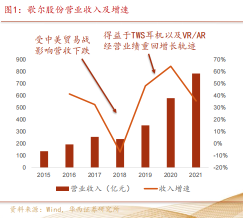
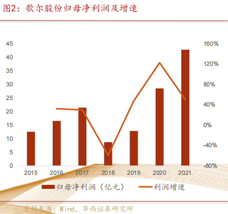
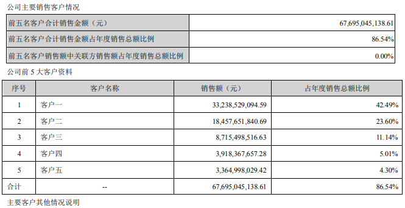

近日，元宇宙概念股歌尔股份公布了2022年股票期权激励计划(草案)与“家园6号”员工持股计划(草案)，两计划(草案)涉及6000余人，同时，其中的员工考核标准透露出该公司2023年营收计划超千亿的目标。

那么，从歌尔股份的基本面情况看，这个目标是否能顺利达成？

2022年以来，歌尔股份的业绩和股价均出现了颓势。除了营收增速下滑，净利出现下降，其毛利率也在持续下滑，股价更是跌跌不休。同时，采用代工模式的歌尔股份患上了明显的大客户依赖症，2021年前五名客户合计销售金额占年度销售总额比例高达86.54%。

业内人士表示，目前“元宇宙”仍仅仅是处于概念火爆阶段，事实上，提升头显设备在消费者市场的接受度仍然任重道远，歌尔股份仍面临下游需求不及预期、行业竞争格局恶化、上游原材料价格持续上涨等风险。而这无疑都是其千亿营收目标道路上的重重阻碍。

**年内营收稳步增长，股价却下滑超四成**

歌尔股份成立于2001年，起家于声学，早年进入苹果产业链供应声学马达MEMS产品；2008年5月，该公司在深交所上市，营业收入首次突破10亿元；之后迎着智能手机的浪潮，其规模加速增长，2013年达到100亿元，5年复合增长率达58.5%。

在2014年之后，歌尔股份基于声学业务向其他协同领域发展，强化传感器、可穿戴和智能制造领域的战略地位，开始布局VR/AR业务，2018年进入苹果TWS产业链。

华西证券研报显示，2019年受益于TWS耳机业务，歌尔股份营收高速增长，2020、2021年公司VR/AR和TWS业务继续带动公司业绩增长。

伴随着元宇宙概念的出现与火爆，此前股价一直表现平平的歌尔股份，在20220-2021两年间出现了股价的大幅上涨，最高报58.11元/股。但从2022年开始，尽管歌尔股份的营收规模仍在增长，其在二级市场并未得到投资者追捧，股价开始呈现出下滑趋势。

财报显示，2022年第一季度，歌尔股份营收201.12亿元，同比增长43.37%；在同一时间段，该公司股价从56.65元/股降至34.21元/股，跌幅约39.61%。

随后，歌尔股份股价震荡下行，6月22日更是出现开盘直线下跌，当日收盘报34.09元/股，跌幅超10.01%，创下今年以来股价最大跌幅。截至7月25日，歌尔股份股价报收30.9元/股，较年初累计下跌45.45%。

那么，为何在歌尔股份实现营收增长的同时，股价却背道而驰呢？

华西证券曾在5月发布的一份研报中表示，股价处于历史低估区间，实际经营情况与估值水平背离。

对此，广科院旗下广科咨询首席策略师沈萌则表示，元宇宙概念很火，但实际上VR/AR设备需求较小，歌尔股份的股价下跌或与此前炒作元宇宙概念的热度下滑有关，与其业绩增长无关。

**一季度净利润同比下滑，年度毛利率处于下行趋势**

实际上，从歌尔股份过往的业绩报告不难发现，尽管该公司年度业绩在持续增长，但其业绩增速已经出现了大幅下滑迹象。今年第一季度，歌尔股份的净利润甚至出现了下滑，同比下降6.71%。

根据歌尔股份发布的2022年半年度业绩预告显示，该公司预计上半年实现归属于上市公司股东的净利润为20.77–24.23亿元，同比增长20% - 40%，而2021年上半年这一增幅为121.71%。

2021年财报信息显示，歌尔股份的主营业务包括精密零组件业务、智能声学整机业务和智能硬件业务，主营业务所属的行业为计算机、通信和其他电子设备制造业。公司的主要产品包括声学、光学、微电子、结构件等精密零组件，以及TWS智能无线耳机、VR虚拟现实/AR增强现实、智能可穿戴、智能家用电子游戏机及配件、智能家居等智能硬件产品。

**歌尔股份的毛利率也处于下行趋势。**

华西证券分析称，2015-2018年由于电子器件盈利能力下降带动毛利率下滑，由2015年的24.9%下降至2018年的18.82%；2018-2019年由于引入毛利率较低的智能声学整机业务，总体毛利率下滑至15.43%；2021年芯片和原材料等涨价，同时新产品的良率爬坡，声学整机业务的毛利率出现下滑，2021年该公司毛利率为14.13%。

歌尔股份2022年Q1的毛利率为13.72%，同比下降0.8个百分点。多名业内人士对记者分析称，歌尔股份的智能硬件业务依然没有摆脱代工，而且国内代工企业的增多使得竞争加剧，其议价能力也在不断减弱。

**大客户依赖症明显**

歌尔股份在年报中表示，其在智能声学整机和智能硬件领域内主要通过“ODM”、“JDM”等模式同行业客户合作。也就是说，代工模式是歌尔股份盈利的重要模式。

而在此模式下，歌尔股份的大客户依赖症也是由来已久。2021年年报显示，歌尔股份前五名客户合计销售金额占年度销售总额比例高达86.54%。

其中第一大客户与第二大客户的销售额占年度销售总额的比例分别为42.49%、23.6%。多名业内人士对记者分析称，这两名客户或分别为苹果与Meta。

然而，一方面，媒体报道苹果的AR/VR头显设备推迟至明年发布；另一方面，分析师预测Meta的元宇宙硬件、头显设备业务放缓。

今年6月份，天风国际分析师郭明錤在社交平台上发布关于Meta VR产品的预测称，Meta将2022年元宇宙硬件的出货量预测下调25%-35%(从1000-1100万件下调至700-800万件)，并推迟了2024年之后所有新的头显设备/AR/MR硬件项目。

对此，歌尔股份在投资者互动平台表示，各项业务均在正常进展中。然而，具体状况如何，外界不得而知。

**AR/VR市场热度能否保温？**

根据IDC数据显示，2021年全年全球AR/VR头显出货量达1123万台，同比增长92.1%，其中VR头显出货量达1095万台。预计2022年，全球VR头显出货1573万台，同比增长43.6%。预计2021年全球AR/VR总投资规模接近146.7亿美元，并有望在2026年增至747.3亿美元，五年复合增长率(CAGR)将达38.5%。

但多名业内人士表示，目前元宇宙仍仅仅是处于概念火爆阶段，实际上，提升头显设备在消费者市场中的接受度仍然任重道远。

IDC中国终端系统研究部分析师赵思泉认为，AR/VR头显消费市场仍然存在非常大的待开发潜力。VR一体机产品在2022年的出货仍将依赖游戏内容的吸引，2021年至今相关厂商的动作节奏加快，新一轮竞争已经开启。

歌尔股份在“家园 6 号”员工持股计划中，透露了2023-2026年的业绩目标：以2021年营业收入为基数，2023-2026年营业收入增长率分别不低于40%、70%、100%、130%。

歌尔股份2021年的营业收入为782.21亿元，以此计算，2023-2026年，歌尔股份的营收目标分别为1095.09亿元、1329.76亿元、1564.42亿元、1799.08亿元。

对于歌尔股份的业绩与业务情况，多家券商给出的数据与歌尔股份的预测大体类似，但由于未来AR/VR市场热度能否持续保温存疑，券商也给出了下游需求不及预期、行业竞争格局恶化、上游原材料价格持续上涨等的风险提示。而这无疑都是歌尔股份千亿营收目标道路上的重重阻碍。