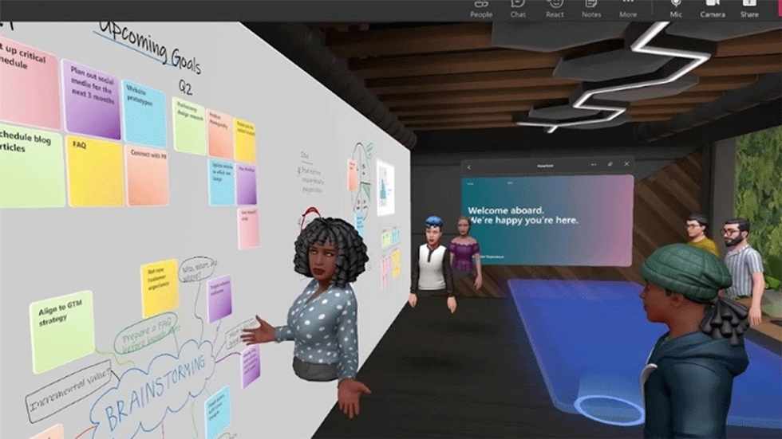

# 元宇宙话题正热，企业、品牌应该加紧上车？麦肯锡调查揭晓，5 大迷思一次揭晓！

> 据麦肯锡（McKinsey & Company）调查，「元宇宙（Metaverse）」一词的网路搜寻量在2021 年激增72 倍，即便是不熟悉的人，也很难忽视这股元宇宙热潮。投资机构高盛（Goldman Sachs）在今年初的报告预估，元宇宙未来将产生规模约8 兆美元的商机，许多投资人、企业不再只是纸上谈兵，与元宇宙相关的公司在去年筹得超过100 亿美元的资金，是2020 年的两倍多。

尽管资本市场蠢蠢欲动，企业、品牌应该如何评估自己准备好跨足元宇宙？入坑前有哪些容易踩的雷区需注意？麦肯锡访查1000 名消费者，数名已开始应用元宇宙技术的专家、企业，统整出以下5 个涉入元宇宙领域前，需先厘清的迷思：

延伸阅读：脸书急着做的元宇宙，30 年前就出现过？从《一级玩家》解析未来虚拟世界

## 迷思一：元宇宙是一项技术吗？
你可能听过无数企业，例如脸书、微软，谈及元宇宙，但也好奇他们说的都是同一个「元宇宙」吗？据麦肯锡的访谈统整，只有2 成多的受访者能说出：「元宇宙像是超越现实的虚拟数位世界。」这类简要定义。剩下7 成多受访者，几乎无法用自己的话，清楚描述元宇宙是什么，且其中4% 的人把元宇宙与Facebook 母公司Meta 连结，认为是该公司的新技术、功能，另外有19% 的人根本理解错误。

其实，元宇宙至今并没有清楚界定。该字词源自1990 年代的科幻小说《雪崩》（Snow Crash），书中描述一个人人能进入，且能在其中互动、消费，甚至工作的虚拟3D 世界。曾任职于亚马逊的投资专家马修·鲍尔（Matthew Ball）认为，只要企业能提供涵盖以下任一特点的服务、产品，都能算是元宇宙范畴，不必受狭义的定义局限：

能提供使用者一个沉浸式环境，涵盖听觉、视觉甚至其他感官的体验享受。且该环境，不见得只能用虚拟实境技术（AR、VR）呈现。
一个能串连现实物理世界与虚拟数位世界的平台，产生双向互动。
一套完全由虚拟货币、数位资产（例如NFT）等经济系统支援的消费生态系。
使用者能采用自己的虚拟化身（avatar）与其他用户交流，创造自己的虚拟内容。
## 迷思二：元宇宙是噱头还是未来？
元宇宙热潮促使多家时尚品牌投入，像 GUCCI、CHRISTIAN LOUBOUTIN、NIKE、RALPH LAUREN 等国际品牌，皆曾在元宇宙中展示、销售自家商品。

 敏捷，是未来的管理核心！2022未来经理人年会，全面解析实务管理心法
但即便如此，许多人仍认为元宇宙，只不过是具有时效性、档期性的行销手段。就连全球最大奢侈品集团LVMH 的CEO 贝尔纳．阿尔诺（Bernard Arnault）都曾在受访时表示，对元宇宙未来是否会泡沫化，持谨慎态度。

但根据麦肯锡的调查，有超过20% 受访者， 表示未来预计会花更多时间在网路上工作、学习、购物或其他娱乐消遣。此外，人们对沉浸式的虚拟体验，愈来愈有兴趣。有约10% 受访者尝试过扩增实境（Augmented Reality，简称AR）或在元宇宙进行社交，其中多数人表示该体验比现实生活中更好。麦肯锡团队认为，人们对于在虚拟世界中，不受时空限制的社交连结、便利消费、娱乐等需求将愈来愈大，因此元宇宙应是未来的长期趋势而非一时噱头。

## 迷思三：元宇宙只能用来打电动？
据麦肯锡访谈，有55% 受访者表示他们听说过至少一个被认为跟元宇宙相关的平台，例如Roblox、Fortnite 或Decentraland。近30% 的受访者则表示曾接触、使用过至少一个元宇宙平台。而这些平台多半是以线上游戏平台为基底的虚拟社群，玩家创建帐号后会有自己的虚拟化身（avatar），能在平台上体验多种游戏，甚至还能自创新游戏、个人空间，来与朋友同乐。

但这并非元宇宙的唯一功能。当访谈团队询问受访者若能进到元宇宙，对从事哪种活动最有兴趣？玩游戏只排到第9 名。更受欢迎的活动包括沉浸式的逛街购物体验、学习、旅行等，甚至有20% 曾体验元宇宙的用户，都参加过音乐会、电影节等虚拟live 节目，显示与电玩游戏结合并非企业唯一的切入点。

## 迷思四：元宇宙的行销对象都是年轻人？
许多时尚品牌切入元宇宙的初衷是为了吸引年轻消费族群。因为根据Roblox 的数据，在该平台每日5000 万的活跃用户中，有2/3 的年龄在16 岁以下。但根据麦肯锡调查，Z 世代（1995 年后出生）并非元宇宙唯一的主力客群。

事实上，Y 世代（又称千禧世代、1980～1995 年出生）对元宇宙的认知度最高，有2/3 的人表示他们曾听说过该名词，且有50% 对这项技术趋势感到兴奋。当问到受访者未来5 年内，预计每天花费在虚拟世界的时间，Y 世代的答案与Z 世代几乎一样：两者都预计每天花费近5 小时在虚拟世界，并希望能在虚拟世界中完成主要的生活任务。结果显示，Y 世代对元宇宙的熟悉度、开放态度不若Z 世代，且论消费能力，Y 世代也许是品牌更不容忽视的对象。

据麦肯锡的消费者研究调查显示，Y 世代是元宇宙中，消费力最高的用户。Y 世代用户平均每年花费在虚拟服务、产品上的花费约是151 美元，（例如购买游戏平台内的装备、资产，或NFT），而Ｚ 世代平均每年的消费约在47～107 美元之间。

延伸阅读：Roblox 凭什么成为「元宇宙第一股」？估值飙450 亿，GUCCI、NIKE 抢入背后
## 迷思五：元宇宙是烧钱的行销手法？
尝试在元宇宙行销过的品牌，也许都同意，要能取得与成本相对应的回报并不容易。目前也有许多争辩投资虚拟世界、元宇宙是否划算的讨论。

麦肯锡提醒，品牌想在元宇宙获得划算的行销效益，除了要够吸睛、创新，还要能让用户在体验时产生共鸣、黏着度，将之转换成品牌的铁粉。例如以街头滑板文化起家的潮流品牌Vans，去年9 月在Roblox 上推出的虚拟滑板公园「Vans World」，用户除了能一同溜滑板，还能用闯关换得的代币，购买给虚拟替身穿的虚拟运动服、滑板，至今吸引超过4800 万游客造访。

另外，品牌也可尝试虚实导流的行销方式，提升品牌知名度之余，也为实体店面增加来客。像是美国连锁墨西哥速食餐厅Chipotle，提供前3 万名造访其「元宇宙分店」的游客一张卷饼优惠卷，让用户能至门市消费兑换，将线上人流变现。
