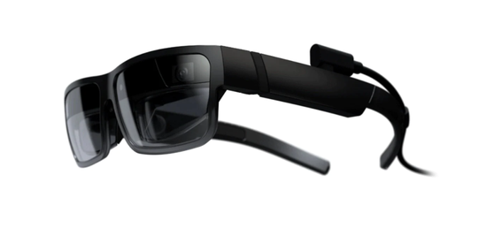
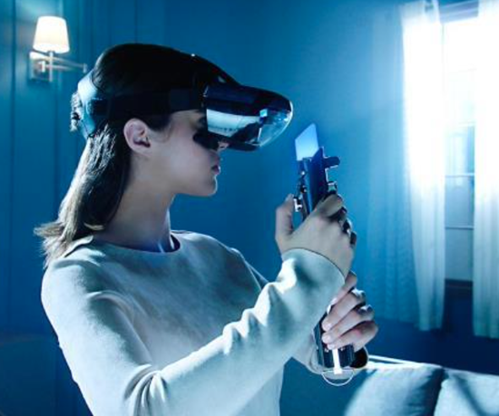
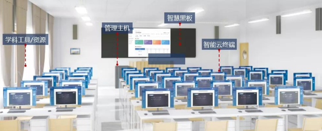
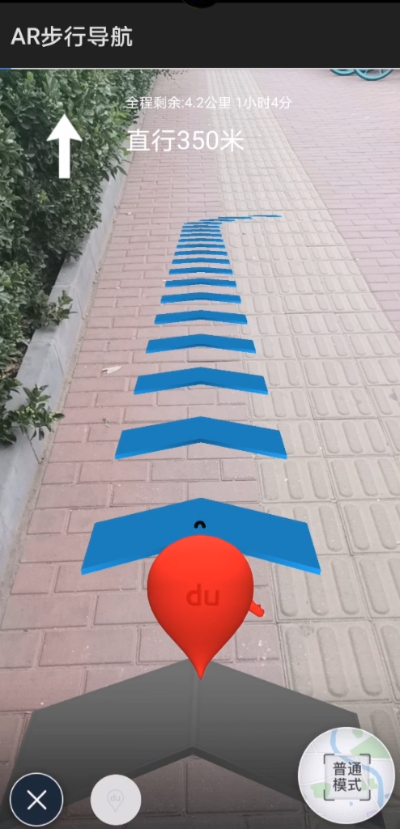

“在新一轮周期面前，联想集团要准确判断自己在周期中的位置，通过技术创新和业务模式升级，架设起一道云梯，稳健地穿越周期。”在2022/23联想财年誓师大会上，联想集团董事长兼CEO杨元庆如此表示。

在联想技术创新和业务模式升级的阶段，其将基于元宇宙应用的AR/VR技术作为了新业务中的关键一环。

尽管从2013年开始，联想就在研发AR/VR技术，并在之后几年接连推出了多款面向C端消费者的AR设备，不过到目前，联想在元宇宙领域的声量并不大。

由于没有自建相关内容生态，联想面向C端用户的VR设备难以维继，目前在联想官方商城已经看不到相关AR设备的身影。

不过，联想并没有放弃在元宇宙的领域的布局，只是其将方向从消费者转向了企业客户。

据连线Insight不完全统计，当前联想面向企业客户已推出Think Reality A3 AR、晨星AR眼镜，并配备了相关解决方案。

联想晨星New G2 Pro AR眼镜，图源联想上海研究院官网

不同于其他玩家开发各类面向C端消费者的元宇宙产品，联想似乎只想一心扑在工业级领域。其表示智能巡检、智能监测、AR实训、远程协作、智能工地这五大类工业应用将成为主要方向。

虽然自身暂不涉足C端，但联想旗下的联想创投还是投资了不少与元宇宙相关的企业，这也是联想的一贯打法，即通过投资或收购来达成某个领域的布局。可元宇宙背后的基础设施如AR/VR、芯片等，依旧是需要重投资、重研发的领域，仅通过投资或许并不能建立足够的壁垒。

为此，联想也在誓师会上表示未来五年将在研发上总投入1000亿人民币，打造核心技术优势，建立护城河。

想法很美好，只是这次联想能够抓住新一轮周期下的机会吗？

**布局元宇宙十年，联想却悄然转向**

“未来五年，研发总投入将超过1000亿人民币。围绕‘端-边-云-网-智’的技术架构，加强基础性研究及突破性技术，着眼近期、中期、长期，分三个赛道投入资源。”杨元庆在2022/23联想财年誓师大会上表示。

在联想未来2-3年的中期规划中，将基于元宇宙应用的AR/VR技术，边缘计算，云服务业务作为了重点，并表示这三大领域将从孕育进入孵化阶段。

值得注意的是，就在联想财年誓师大会当月，联想集团同时公开了“联想元宇宙深瞳数字资产治理平台”，作为聚焦B2B的平台，联想期望通过这个平台构建完整的元宇宙生态。

这些年，联想一直在主抓技术创新，而代表了未来技术的元宇宙领域，自然成为了联想的重要方向，其也获得了些许成果。

今年1月，《时代》周刊将联想Think Reality A3 AR 智能眼镜列为“2021年的100项最佳发明”，一同入选的还有英伟达为元宇宙建立提供基础的模拟和协作平台——英伟达Omniverse等。

Think Reality A3 AR 智能眼镜，图源联想官网

据官方资料显示，目前Think Reality A3定位是企业级智能眼镜，有PC版和工业版两种型号可选，前者可与PC设备绑定，后者可与摩托罗拉旗舰智能机配对使用。这款眼镜可以在虚拟视野中管理电子邮件、开电话会议和处理文件，可用于远程协助、指导工作、辅助工业生产等。

联想还专门提供了Think Reality平台解决方案，支持用户在现实世界中利用 3D 数字信息实现定位、互动和协作，提升用户的情境感知和工作效率。该平台兼容其他设备和云平台，为的是方便企业客户跨越多个操作系统、云服务和设备使用和管理增强现实、虚拟现实软件应用程序。

这已不是联想初次推出AR相关设备。早在2013年联想就在探索AR技术的落地应用，并于2017年推出了全球首款沉浸式AR游戏设备——联想Mirage AR智能头盔套装。

在内容方面，联想选择与迪士尼合作开发星球大战IP类游戏，由此联想Mirage AR设备内置了全息象棋、战术对抗、光剑交战三款星球大战游戏，并且该设备除了在联想官网商城、京东、苏宁等渠道售卖外，还同步在Disney迪士尼官方旗舰店发售。

在星战IP的加持下，三个月内联想Mirage AR设备卖出了50万套。当年，联想还在TechWorld上公布Mirage星战AR套装，已经成为2017年世界上销量最高的AR设备，占据80%的AR市场份额。这绝对是联想AR设备的高光时刻。

联想Mirage AR头戴设备，图源联想2017/18财年财报

看到Mirage AR设备的成功后，联想趁热打铁在2018年的美国CES消费电子展，又发布了全球首款搭载谷歌Daydream 虚拟现实平台的VR一体机联想Mirage Solo，主打不需要和手机配对或是另外连接电源，就能一体式运作，并兼容了多款游戏。

值得注意的是，当时同步推出的还有Facebook的VR头显设备Oculus Go，售价199美元，而联想Mirage Solo售价399.99美元。

但Mirage Solo并没有如联想预想的受到消费者追捧，这或许与其没有打造属于自己的内容生态有关。

联想也意识到了这一点。在2018联想创新科技大会上，时任联想全球副总裁、平板电脑及智能设备事业部总经理姚立就表示：“我们需要内容，所以从内到外联想Mirage AR与众多创投公司一起合作。并且在不同类型的内容上不断拓展我们的内容。”

在这次大会上，姚立还透露2019年联想Mirage AR将投入另一个超级IP内容，此后联想Mirage AR每年至少投入一亿元在内容开发上。

但联想的AR内容生态迟迟没有做起来，AR设备也就此沉寂，如今联想商城早已下架了Mirage相关产品。

或许是经历过消费级AR设备的困境，现在联想的AR设备转向了企业级，连带着其他元宇宙布局也偏向卖给企业客户，而不是终端消费者。

此前，联想还以计算机视觉技术为核心，打造了一个包含硬件与方案端到端的品牌——晨星。最初晨星在2017年发布过一款MR眼镜，既可在C端用于AR游戏、大屏观影，又可在B端用于智能巡检、远程写作等场景。

但如今，在联想研究院的官网介绍中，晨星AR设备及云服务平台，变为了给工业、工程、教育和医疗等领域提供基于AR巡检、培训等应用解决方案。

在元宇宙领域布局多年后，联想的方向彻底转变了，它又能打动多少企业？

**想磕B端企业，也不容易**

戴上AR眼镜，原本细密的飞机组件孔位陡然被放大了许多，更关键是有了坐标定位，工人再也不需要自行找寻并辨别孔位，只需要按照AR眼镜提供的坐标将每一根线束插接入孔位即可。

2018年底，联想研究院与中国商飞公司达成协议，利用晨星AR助力国产大飞机智能装配。这也是联想元宇宙落地的重要项目。

在大飞机制造和装配的过程中涉及大量线缆，如C919大飞机就有约15000根线缆，扎成约500根线束，而线缆跟连接器之间的连接是比较复杂的，比如100多个孔的连接器，孔与孔之间的距离很小。

晨星AR眼镜辅助接线，图源联想集团官方微信公众号

按照常规的接线操作，需要三个工人同时协同工作，分别担任操作、指导、检测的角色。不仅工程量巨大且易于出错，而且耗时漫长。

但有了AR设备辅助工作后，原先三个人需要花两个小时才能完成80孔的连接器端接工作，现在一个操作人员就可以在二十分钟完成诸多导线插接到连接器上的任务，即使是非熟练操作人员也能快速上手。

“当前整个工业面临着产业升级的需求，在这一背景下更应通过AR技术和AI技术的结合，来提高工业的智能化，达到降本增效的目的。”联想集团副总裁、上海研究院院长毛世杰曾在接受央视采访时表示。

当前，联想也在努力将元宇宙落地到更多工业领域，智能巡检、智能监测、AR实训、远程协作、智能工地这五大类工业应用成为了主要方向。

例如，联想晨星AR也应用在了智能巡检领域。在传统巡检中，存在纸质工单存档，巡检记录数据查询不便且容易丢失的情况，而且巡检项目内容繁杂，人工巡检也容易造成错漏，因此利用AR设备巡检可以解决不少问题。

AR眼镜可以实时提示巡检步骤与内容，并通过表计识别等加快巡检过程，降低由于人工读数错误、笔误等造成的偏差。另外，巡检人员遇到无法解决的问题时，也可以通过远程协助功能，将“第一视角”共享给远程专家，进而实时解决问题。

从公开信息来看，联想的AR巡检业务已经获得了国内某变电站、国产新能源车企的订单。

但这一领域竞争也较为激烈，不仅有阿里、华为、百度等互联网大厂入局，也有商汤、科大讯飞、亮风台等众多玩家入场。联想要想获得更多客户，也需要展现更多过人的实力。

在教育领域，联想还推出了AR超级教室，其想要实现知识具象化，通过虚拟现实增加教学趣味，让学生在互动中加深理解。并且联想研究院还打造了一款未来黑板“HoloBoard”，这款设备可结合镜像世界技术和全息网真，实现老师在异地虚拟空间的映射，再结合沉浸式投影技术将老师的画面投射到HoloBoard未来黑板上，完成教学场景中各种虚实结合的互动和教学。

联想智慧教室，图源联想官方网站

但在教育领域，教师的教学水平与质量才是关键，AR只是一种辅助设备，而且用得起这种设备的学校，或许也不需要靠这类设备来提升学生学习质量。

联想也将晨星 AR 眼镜应用在了医疗领域，试图实现手术过程实时远程直播、医疗数据可视化。

近些年，医疗AR/VR行业的确在不断增长。据Global Market Insights数据，2020年，全球医疗AR/VR行业市场规模在19亿美元以上，未来几年将以超35.8%的年复合增长率增长，其中提到手术部门将是最大的增长动力。

联想在工业领域的元宇宙落地应用，也与今年的整体战略相似，那就是在保障基本盘的情况下，再扩张其他领域，这能够帮助其抢到一定的市场份额。

但联想在元宇宙领域的野心不止于此，其还想通过元宇宙带动其他业务，只是这或许不是一件易事。

**依靠元宇宙，联想能带动其他业务吗？**

“在新的财年中，要抓住包括AR /VR，人工智能，智能家居和智能协作在内的新机遇，并进一步激活提升联想和摩托罗拉品牌。”联想集团高级副总裁、IDG总裁Luca Rossi在联想集团2022/23财年誓师大会上表示。

如果说PC是互联网时代的入口，智能手机是移动互联网时代的入口，那么AR /VR+人工智能就是打开元宇宙的钥匙。而联想显然想将三把钥匙结合起来，试图协同发展带动所有业务。

联想是憋着一口气的。2014年，联想花了29亿美元从谷歌手里收购摩托罗拉移动后，本来期望摩托罗拉能在高端产线与苹果、三星一较高下。

但事实是这笔收购不仅拖累了联想集团，导致联想在2015/2016年度业绩中由于重组摩托罗拉净亏损1.28亿美元，而且摩托罗拉的销量也一落千丈。据IDC预计，2015年摩托罗拉在中国的出货量为20万部，同期小米手机的出货量为6500万部。现在各大统计机构的年度份额榜单中，摩托罗拉更是长期处于“其他”位置。

现在，联想指望用元宇宙业务，带动低落的手机业务，形成业务互补。

例如阿里、百度都将AR技术应用在了自家的地图产品中，通过AR实现精准导航的同时，还能添加商户促销信息，带来更多玩法。

百度地图的AR步行导航，图源百度地图开放平台官网

华为不仅发布了XR专用芯片，游戏控制器和VR头显相关专利，还围绕“1+8+N”战略集结了5G、云服务、AI/VR/AR等一系列前沿技术，并在尝试构建自有闭环生态。

布局与未来规划，均着重强调B端业务，原本面向C端的产品也不再发售，这或许难以带动智能手机所在的C端业务发展。

尽管自身暂未将C端业务作为元宇宙发展的重点，但联想投资了众多元宇宙产业链上下游的公司。据不完全统计，联想集团旗下的联想创投投资了耐德佳、XIMMERSE、煦象、当红齐天等多家VR/AR领域企业。

通过投资或收购来达到产业布局，这是联想在PC、手机业务发展时的常用打法，但这一打法并不能一定奏效，摩托罗拉就是前车之鉴。

与此同时，当前元宇宙领域已经挤入了太多玩家，不仅有阿里、腾讯、百度、华为这些实力大厂驻足，还有商汤、旷视、云从这类AI公司试图发展第二曲线，更有数不清的垂直玩家。

联想要想发展好元宇宙，必然会与各家厂商展开正面较量，而且支撑元宇宙发展的底层基础设施如AR/VR、芯片、软件、操作系统等都需要投入大量研发才能形成一定的竞争壁垒，联想在这方面并不占优势。

对比来看，联想20/21财年研发投入为120.38亿元，占全年收入的2.92%，而华为2021年研发投入为1427亿元，占全年收入的22.4%；阿里巴巴2021年全年技术相关成本费用超1200亿元，占2022财年营收的14.07%。

无论从研发资金额度，还是研发投入占比全年收入来看，联想的研发投入实在过于低。这也是联想为何表态未来五年要投入1000亿用于研发的原因。

现在下定决心补上研发的短板，或许为时未晚，只是能否抓住下一代浪潮的机会，目前还看不到答案。 